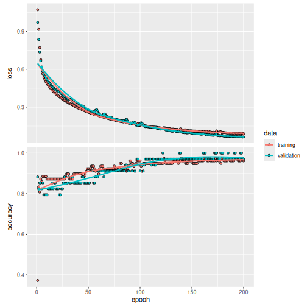
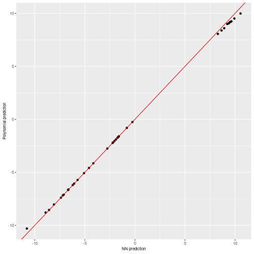
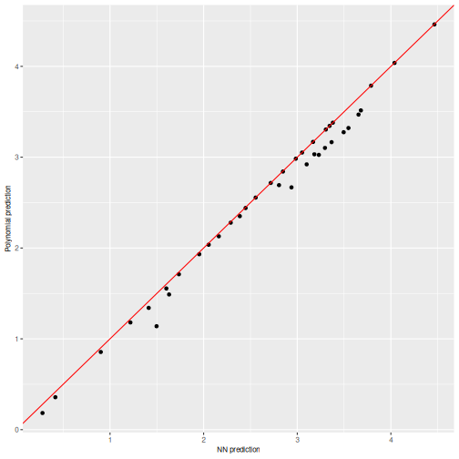
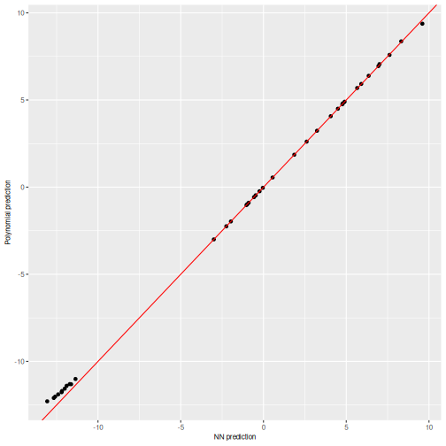
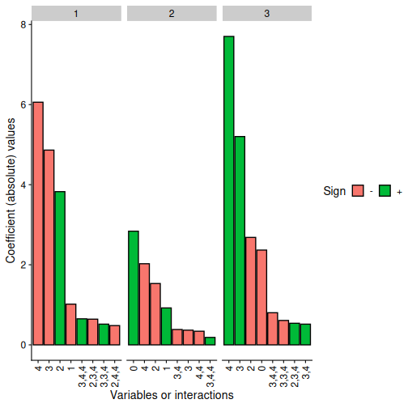
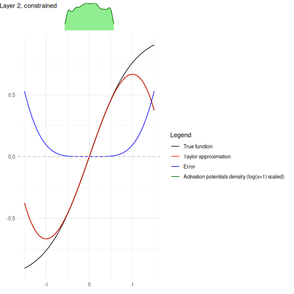
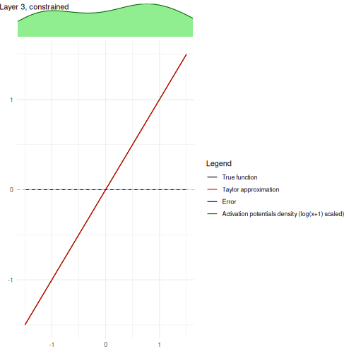

# Classification example using tensorflow

## Multiclass classification example

After showing how to use `nn2poly` in a regression setting both in
[`vignette("nn2poly-01-introduction")`](https://ibidat.github.io/nn2poly/articles/nn2poly-01-introduction.md)
and
[`vignette("nn2poly-02-supported-DL-frameworks")`](https://ibidat.github.io/nn2poly/articles/nn2poly-02-supported-DL-frameworks.md),
we will see here a multiclass classification example using the iris
dataset to showcase how nn2poly obtains a polynomial for each class (or
output neuron).

In order to train our model we will use in this case the
`keras`/`tensorflow` framework, and we will benefit from the provided
support for it in `nn2poly` as we saw in
[`vignette("nn2poly-02-supported-DL-frameworks")`](https://ibidat.github.io/nn2poly/articles/nn2poly-02-supported-DL-frameworks.md).

``` r

library(nn2poly)
library(keras)

# This sets all needed seeds
tensorflow::set_random_seed(42)
```

### Data preparation

First we load the `iris` dataset and scale the data to the $`[-1,1]`$
interval:

``` r

# Load the data
data(iris)

# Change response to numeric. In this case, Species was already numeric,
# but this step is needed if it is a factor variable.
iris$Species <- as.numeric(iris$Species)

# Define dimension p (number of predictor variables)
p <- dim(iris)[2] - 1

# Define objective classes
n_class <- max(iris[,(p+1)])

# Move objective classes from (1:3) to (0:2), needed for tensorflow
iris[,(p+1)] <- iris[,(p+1)] - 1
```

``` r

# Scale the data in the [-1,1] interval and separate train and test
# Only the predictor variables are scaled, not the response as those will be
# the different classes.
iris_x <- iris[,-(p+1)]
maxs <- apply(iris_x, 2, max)
mins <- apply(iris_x, 2, min)
data_x_scaled <- as.data.frame(scale(iris_x, center = mins + (maxs - mins) / 2, scale = (maxs - mins) / 2))
data <- cbind(data_x_scaled, iris[,(p+1)])

# Divide in train (0.75) and test (0.25)
index <- sample(1:nrow(data), round(0.75 * nrow(data)))
train <- data[index, ]
test <- data[-index, ]

train_x <- as.matrix(train[,-(p+1)])
train_y <- as.matrix(train[,(p+1)])

test_x <- as.matrix(test[,-(p+1)])
test_y <- as.matrix(test[,(p+1)])
```

### Neural network

In this section we will create and train (imposing weight constraints)
our original neural network that will be later explained by
[`nn2poly()`](https://ibidat.github.io/nn2poly/reference/nn2poly.md).

#### Build and train the NN

First, we build the model.

``` r


keras_model <- function() {
  tensorflow::set_random_seed(42)

  nn <- keras::keras_model_sequential()
  nn <- keras::layer_dense(nn, units = 100, activation = "tanh", input_shape = p)
  nn <- keras::layer_dense(nn, units = 100, activation = "tanh")
  nn <- keras::layer_dense(nn, units = n_class, activation = "linear")

  nn
}

nn <- keras_model()
# Impose weight constraints provided by nn2poly package
nn <- add_constraints(nn, constraint_type = "l1_norm")
nn
#> Model: "sequential_3"
#> ________________________________________________________________________________________________________________________
#>  Layer (type)                                         Output Shape                                    Param #           
#> ========================================================================================================================
#>  dense_11 (Dense)                                     (None, 100)                                     500               
#>  dense_12 (Dense)                                     (None, 100)                                     10100             
#>  dense_13 (Dense)                                     (None, 3)                                       303               
#> ========================================================================================================================
#> Total params: 10903 (42.59 KB)
#> Trainable params: 10903 (42.59 KB)
#> Non-trainable params: 0 (0.00 Byte)
#> ________________________________________________________________________________________________________________________
```

> *Note*: In this case the NN has a *linear* output with the same number
> of neurons as the number of classes to predict (3 species, `n_class`).
> Then, the linear output will be transformed into a *probability* to
> find the most probable class but this step is done *after training*.
> Therefore, nn2poly will be used to obtain a polynomial that
> approximates this *nn with linear outputs* and then its results will
> also be transformed in probabilities to predict the highest
> probability class.

Then we compile and train the model, using a categorical crossentropy
loss and accuracy as the chosen metric.

``` r

compile(nn,
        loss = loss_sparse_categorical_crossentropy(from_logits = TRUE),
        optimizer = optimizer_adam(),
        metrics = "accuracy")

history <- fit(nn,
               train_x,
               train_y,
               verbose = 0,
               epochs = 200,
               validation_split = 0.3
)

plot(history)
```



#### NN Predictions

In this case, to asses the NNs accuracy we have to transform their
output into a probability, which we will do by using
[`layer_activation_softmax()`](https://rdrr.io/pkg/keras/man/layer_activation_softmax.html)
and then choosing the class with highest probability with `k_argmax`.

``` r

# Define the model probability model using our previously trained nn
probability_model <- keras_model_sequential() %>%
  nn() %>%
  layer_activation_softmax() %>%
  layer_lambda(k_argmax)

# Obtain the predicted classes with the NN to compare them
prediction_NN_class <- predict(probability_model, test_x)
#> 2/2 - 1s - 537ms/epoch - 268ms/step
```

> *Note*: As said before,
> [`nn2poly()`](https://ibidat.github.io/nn2poly/reference/nn2poly.md)
> will approximate the linear output of the neural network, so we will
> need to perform these transformation also in the polynomial
> predictions to obtain a classification response.

We can also compute the linear output of the model (before converting it
to a probability) and store it to compare with the polynomial output
later.

``` r

# Also, the linear output can be predicted before the probability model
prediction_NN <- predict(nn, test_x)
#> 2/2 - 0s - 70ms/epoch - 35ms/step
```

Finally We can use here a confusion matrix to visualize the results,
where we can see that that the NN correctly predicts almost all of the
classes in the test data:

``` r

# Create a confusion matrix
cm <- caret::confusionMatrix(as.factor(prediction_NN_class), as.factor(test_y))
cm
#> Confusion Matrix and Statistics
#> 
#>           Reference
#> Prediction  0  1  2
#>          0 11  0  0
#>          1  0 11  1
#>          2  0  1 14
#> 
#> Overall Statistics
#>                                           
#>                Accuracy : 0.9474          
#>                  95% CI : (0.8225, 0.9936)
#>     No Information Rate : 0.3947          
#>     P-Value [Acc > NIR] : 7.82e-13        
#>                                           
#>                   Kappa : 0.9203          
#>                                           
#>  Mcnemar's Test P-Value : NA              
#> 
#> Statistics by Class:
#> 
#>                      Class: 0 Class: 1 Class: 2
#> Sensitivity            1.0000   0.9167   0.9333
#> Specificity            1.0000   0.9615   0.9565
#> Pos Pred Value         1.0000   0.9167   0.9333
#> Neg Pred Value         1.0000   0.9615   0.9565
#> Prevalence             0.2895   0.3158   0.3947
#> Detection Rate         0.2895   0.2895   0.3684
#> Detection Prevalence   0.2895   0.3158   0.3947
#> Balanced Accuracy      1.0000   0.9391   0.9449
```

### Polynomial representation

#### Using `nn2poly`

After the NN has been trained, we can directly call
[`nn2poly()`](https://ibidat.github.io/nn2poly/reference/nn2poly.md) on
the model, where we only need to choose the value `max_order` which will
limit the order of the computed coefficients in the final polynomial. In
this case we will set it as `3`.

Note that in this case, as we have 3 output neurons, there will be 3
output polynomials. The polynomials will be stored in the same way as in
the regression case, in a list with labels and values, but in this case
the values will be a matrix with 3 rows, where each row will be the
polynomial obtained for each output neuron.

``` r

# Polynomial for nn
final_poly <- nn2poly(object = nn,
                      max_order = 3)
final_poly
#> nn2poly p=4 max_order=3 (35 coefficients)
#> 
#>    Label   layer_1.1    layer_1.2        Value
#> 1      0  0.04067110  2.838696843 -2.366766781
#> 2      1 -1.01692941  0.922284418  0.306761949
#> 3      2  3.82618116 -1.532152710 -2.683000363
#> 4      3 -4.86343231 -0.367029543  5.201883302
#> 5      4 -6.05908192 -2.026009687  7.701674287
#> 6    1 1  0.02216651 -0.068650520  0.031318424
#> 7    1 2 -0.09821704  0.115922790  0.007638464
#> 8    1 3  0.08146321 -0.072443687 -0.025525971
#> 9    1 4  0.04337401 -0.019371435 -0.029198241
#> 10   2 2  0.08763214 -0.122314949  0.007196768
#> 11   2 3 -0.13090939  0.160297255  0.008898178
#> 12   2 4 -0.03982067  0.118363267 -0.047742066
#> 13   3 3 -0.03990281 -0.186113959  0.182447863
#> 14   3 4 -0.22518835 -0.383706217  0.517483516
#> 15   4 4 -0.21539498 -0.340738887  0.476052813
#> 16 1 1 1  0.01640874 -0.015861276 -0.004179789
#> 17 1 1 2 -0.08649263  0.054035970  0.045407945
#> 18 1 1 3  0.08657836 -0.020808952 -0.071458205
#> 19 1 1 4  0.10626469  0.016833176 -0.120917330
#> 20 1 2 2  0.08459576 -0.071715667 -0.029934108
#> 21 1 2 3 -0.12782438  0.099225772  0.053682008
#> 22 1 2 4 -0.14300672  0.061378474  0.099556507
#> 23 1 3 3  0.06399315 -0.058123074 -0.020400644
#> 24 1 3 4  0.07906045 -0.071096688 -0.027609865
#> 25 1 4 4  0.07534905 -0.054539678 -0.035542528
#> 26 2 2 2 -0.12832426  0.057078039  0.086244566
#> 27 2 2 3  0.31410803 -0.112572013 -0.233324120
#> 28 2 2 4  0.39822396 -0.072171273 -0.351003593
#> 29 2 3 3 -0.30494053  0.117239273  0.220625579
#> 30 2 3 4 -0.64179975  0.150429652  0.539640298
#> 31 2 4 4 -0.48146100  0.078259568  0.429785817
#> 32 3 3 3  0.17561246  0.009075899 -0.185280585
#> 33 3 3 4  0.51767933  0.109300146 -0.609898095
#> 34 3 4 4  0.65067978  0.186264474 -0.802660943
#> 35 4 4 4  0.34526955  0.146409430 -0.461815650
```

#### Obtaining polynomial predictions

As said before, the obtained polynomial represents the neural network
before including the softmax function and computing the class assigned
to each observation. Then, we need to define again a keras sequential
model that includes the class computation from the polynomial output.
This polynomial output is obtained with
[`predict()`](https://rdrr.io/r/stats/predict.html) used on the
[`nn2poly()`](https://ibidat.github.io/nn2poly/reference/nn2poly.md)
output, in this case in matrix form, as the 3 polynomials are evaluated
at the same time:

``` r


# Obtain the predicted values for the test data with our Polynomial Regression
prediction_poly_matrix <- predict(object = final_poly, newdata = test_x)

# Define probability model with keras for the polynomial outputs
probability_poly <- keras_model_sequential() %>%
  layer_activation_softmax() %>%
  layer_lambda(k_argmax)

# Class prediction with the polynomial outputs
prediction_poly_class <- predict(probability_poly,
                                 prediction_poly_matrix)
#> 2/2 - 2s - 2s/epoch - 1s/step
```

#### Visualizing the results

With the polynomial predictions, there are two options. We can represent
in a diagonal line the linear outputs obtained directly from the
polynomial and NN predictions, or compare the assigned classes after
employing the probability models. Please note here that we compare the
predictions (linear and classes) of the polynomials with the NN
predictions and not the original data, as `nn2poly`’s goal is to
faithfully represent the NN behavior independently of how well the NN
predicts.

First, let’s observe the confusion matrix for the assigned classes:

``` r


# Confussion matrix between NN class prediction and polynomial class prediction
cm_poly <- caret::confusionMatrix(as.factor(prediction_NN_class), as.factor(prediction_poly_class))
cm_poly
#> Confusion Matrix and Statistics
#> 
#>           Reference
#> Prediction  0  1  2
#>          0 11  0  0
#>          1  0 12  0
#>          2  0  0 15
#> 
#> Overall Statistics
#>                                      
#>                Accuracy : 1          
#>                  95% CI : (0.9075, 1)
#>     No Information Rate : 0.3947     
#>     P-Value [Acc > NIR] : 4.568e-16  
#>                                      
#>                   Kappa : 1          
#>                                      
#>  Mcnemar's Test P-Value : NA         
#> 
#> Statistics by Class:
#> 
#>                      Class: 0 Class: 1 Class: 2
#> Sensitivity            1.0000   1.0000   1.0000
#> Specificity            1.0000   1.0000   1.0000
#> Pos Pred Value         1.0000   1.0000   1.0000
#> Neg Pred Value         1.0000   1.0000   1.0000
#> Prevalence             0.2895   0.3158   0.3947
#> Detection Rate         0.2895   0.3158   0.3947
#> Detection Prevalence   0.2895   0.3158   0.3947
#> Balanced Accuracy      1.0000   1.0000   1.0000
```

The polynomials obtain the same results as the original NN.

Then, we can extract a diagonal plot for each of the polynomials
obtained, in total $`3`$ diagonal plots.

``` r

for (i in 1:3){
  print(
    nn2poly:::plot_diagonal(x_axis =  prediction_NN[,i],
                  y_axis =  prediction_poly_matrix[,i],
                  xlab = "NN prediction",
                  ylab = "Polynomial prediction")
        )
}
```



We can observe how all the polynomials obtain quite similar predictions
to their equivalent NN predictions.

We can also plot the $`n`$ most important coefficients in absolute value
to compare which variables or interactions are more relevant in each
polynomial. In this case, we will have 3 plots for each NN again, one
per polynomial at each output neuron. In this case, the obtained
coefficients will represent the most important variables when assigning
the probability to be in each class.

``` r

plot(final_poly, n = 8)
```



> *Note*: The coefficients values are not in the same scale as the
> original polynomial due to the fact that we have scaled all the data
> before training, even the response variable Y. Furthermore, as data
> has been scaled to the $`[-1,1]`$ interval, interactions of order 2 or
> higher would usually need a higher absolute value than the lower order
> coefficients to be more relevant

Finally, the problem with Taylor expansion can be checked with the
following plots, where each layer is represented with their activation
function, its Taylor expansion, the error and also the density of the
activation potentials that the activation functions receives at that
layer.

It can be clearly seen with the activation potentials density, in green,
that it is kept close to zero, thus having an accurate Taylor expansion
around zero at each hidden layer.

``` r

nn2poly:::plot_taylor_and_activation_potentials(object = nn,
                                                data = train,
                                                max_order = 3,
                                                constraints = TRUE)
#> [[1]]
```


    #> 
    #> [[2]]



    #> 
    #> [[3]]


