# Overall package goal

The main objective of `nn2poly` is to obtain a representation of a feed forward artificial neural network (like a multilayered perceptron) in terms of a polynomial representation. The coefficients of such polynomials are obtained by applying first a Taylor expansion at each activation function in the neural network. Then this expansions and the given neural network weights are joint using combinatorial properties, obtaining a final value for the polynomial coefficients.

More information with the theoretical insights about the underlying mathematical process used to build this relationship can be found in the following references:
  * Initial development of the idea for a single hidden layer neural network in this [article](https://doi.org/10.1016/j.neunet.2021.04.036) or its free access [arXiv preprint version](https://doi.org/10.48550/arXiv.2102.03865).
  * Extension to deeper layers and proper formulation of the _NN2Poly_ method in this [arXiv preprint](https://doi.org/10.48550/arXiv.2112.11397).

----
*Important remark 1*: The approximations made by the NN2poly method rely on Taylor expansions and therefore require some constraints to be imposed when training the original neural network. This package, `nn2poly`, does not implement this constraints as it only uses the final weight matrices and some information about the neural network architecture, it does not limit how the user trains the neural network. However, we also provide an auxiliary package `nn2poly.tools` for this matter, which will be explained and properly introduced in `vignette("nn2poly-02-constraints")`.
----

----
*Important remark 2*: `nn2poly` is not limited to a special deep learning framework. As mentioned in the previous remark, only the weight matrices and some information about the neural network architecture is needed. Therefore, the framework used is not relevant. However, in this vignette examples we will be using `tensorflow` and `keras`. Furthermore, support for the training constraints in `nn2poly.tools`, explained in the previous remark, is currently limited to `tensroflow` and `keras`too.
----

# This vignette's goal

Here we aim to present the most simple use cases for `nn2poly`. For that matter, we will showcase how to use it in a regression problem with simulated data and then in a classification problem in the iris dataset. In both cases, a neural network will be trained first to solve the problem, and then `nn2poly` will generate one or several polynomials that approximate the neural network behavior.

In this case the neural network training will not have any constraint imposed. Then, as explained previously, the final approximation by the polynomial may not be accurate enough. For more information on how to impose those constraints and obtain good approximations, please see `vignette("nn2poly-02-constraints")`.

The initial setup will be as follows, where besides the `nn2poly` package, we will load the `keras` package, which also loads `tensorflow`, used in this example to build and train the neural networks.


```r
library(nn2poly)
library(keras)

# For reproducibility
set.seed(1)
tensorflow::tf$random$set_seed(1)
```


## Simple regression example

This example will solve a regression problem using simulated data from a polynomial, which allows to control if the final polynomial coefficients obtained with `nn2poly` are similar to those from the polynomial that originates the data.


### Simulated data generation

We will simulate polynomial data as follows. First we define a polynomial using the format needed in `nn2poly`, specifically to use the function `eval_poly`, which consists of a list containing:
  * Labels: A list of integer vectors denoting the combinations of variables that appear on each term of the polynomial. Variables are numbered from `1` to `p` where `p` is the dimension of the problem. As an example, `c(1,1,3)` would represent the term $x_1^2x_3$
  * Values: Vector containing the numerical values of the coefficients denoted by labels. If multiple polynomials with the same terms but different coefficients want to be represented, a matrix can be employed, where each row is a polynomial.

Here we create the polynomial : $4x_1 - 3 x_2x_3$:


```r

polynomial <- list()
polynomial$labels <- list(c(1), c(2,3))
polynomial$values <- c(4,-3)
```


With said polynomial, we can now generate the desired data that will train the NN for our example. We will employ a normal distribution to generate variables $x_1, x_2, x_3$ and also an error term $\epsilon$. Therefore, the response variable $y$ will be generated as: $y = 4x_1 - 3 x_2x_3 + \epsilon$


```r
# Define number of variables p and sample n
p <- 3
n_sample <- 500

# Predictor variables
X <- matrix(0,n_sample,p)
for (i in 1:p){
  X[,i] <- rnorm(n = n_sample,0,1)
}

# Response variable + small error term
Y <- as.vector(eval_poly(X,polynomial)) + stats::rnorm(n_sample, 0, 0.1)

# Store all as a data frame
data <- as.data.frame(cbind(X, Y))
head(data)
#>           V1          V2          V3         Y
#> 1 -0.6264538  0.07730312  1.13496509 -2.684020
#> 2  0.1836433 -0.29686864  1.11193185  1.632335
#> 3 -0.8356286 -1.18324224 -0.87077763 -6.344179
#> 4  1.5952808  0.01129269  0.21073159  6.279883
#> 5  0.3295078  0.99160104  0.06939565  1.165488
#> 6 -0.8204684  1.59396745 -1.66264885  4.650553
```

Then we will scale the data to have everything in the $[-1,1]$ interval and divide it in train and test datasets.


```r
# Data scaling
maxs <- apply(data, 2, max)
mins <- apply(data, 2, min)
data <- as.data.frame(scale(data, center = mins + (maxs - mins) / 2, scale = (maxs - mins) / 2))

# Divide in train (0.75) and test (0.25)
index <- sample(1:nrow(data), round(0.75 * nrow(data)))
train <- data[index, ]
test <- data[-index, ]

train_x <- as.matrix(train[,-(p+1)])
train_y <- as.matrix(train[,(p+1)])

test_x <- as.matrix(test[,-(p+1)])
test_y <- as.matrix(test[,(p+1)])
```


### Original neural network

With our simulated data ready, we can train a feed forward dense neural network.

The method is expected to be applied to a given trained densely connected feed forward neural network (NN from now on), also referred as multilayer perceptron (MLP). Therefore, this step is completely **optional** and can be skipped if any preferred method has been used to train a NN and there is an already given NN and its weights.

In order to present an example, here we will create and train a NN. Our choice will be to use the `keras` framework to build and train it.

----
*Note*: It is important to note that in order to avoid asymptotic behaviour of the method, it is useful to impose some kind of constraints when training the neural network weights. This is covered in `vignette("nn2poly-02-constraints")`.
----

First, we build the model.


```r
nn <- keras_model_sequential()

nn %>% layer_dense(units = 10,
                  activation = "tanh",
                  input_shape = p)

nn %>% layer_dense(units = 10,
                  activation = "tanh")

nn %>% layer_dense(units = 1,
                  activation = "linear")

nn
#> Model: "sequential_12"
#> __________________________________________________________________________________________________________________________
#>  Layer (type)                                         Output Shape                                     Param #            
#> ==========================================================================================================================
#>  dense_14 (Dense)                                     (None, 10)                                       40                 
#>  dense_15 (Dense)                                     (None, 10)                                       110                
#>  dense_16 (Dense)                                     (None, 1)                                        11                 
#> ==========================================================================================================================
#> Total params: 161
#> Trainable params: 161
#> Non-trainable params: 0
#> __________________________________________________________________________________________________________________________
```

Compile the model:


```r
compile(nn,
        loss = "mse",
        optimizer = optimizer_adam(),
        metrics = "mse")
```

And train it:


```r
history <- fit(nn,
               train_x,
               train_y,
               verbose = 0,
               epochs = 300,
               validation_split = 0.3
)
```

We can visualize the training process:


```r
plot(history)
```

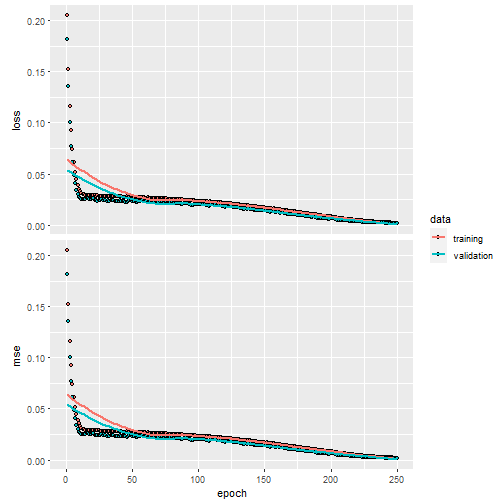

And we can also visualize the NN predictions vs the original Y values.


```r
# Obtain the predicted values with the NN to compare them
prediction_NN <- predict(nn, test_x)

# Diagonal plot implemented in the package to quickly visualize and compare predictions
plot_diagonal(x_axis =  prediction_NN, y_axis =  test_y, xlab = "NN prediction", ylab = "Original Y")
```

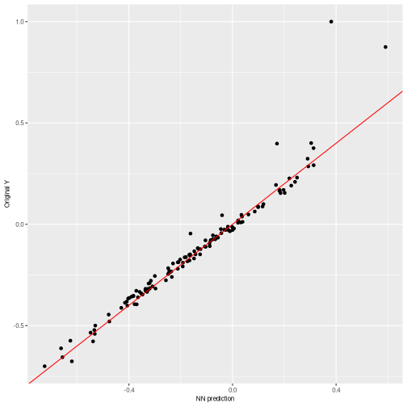


----
*Note*: Recall that the NN performance is not addressed by nn2poly, meaning that this performance could be either good or bad and nn2poly still represent the NN behavior.
----


### Using nn2poly to obtain  the polynomial

After the NN has been trained, using any chosen method by the user, the parameters have to be extracted and reshaped, if needed, to match the expected input of the function `nn2poly_algorithm()`. This input consists of the following objects:

* `weights_list`: A list of matrices with a weight matrix at each layer. The weights matrices should be of dimension ((1+input) * output) where the first row corresponds to the bias vector, and the rest of the rows correspond to each of the ordered vector weights associated to each input.
* `af_string_list`: A list of strings with the names of the activation functions at each layer.
* `q_taylor_vector`: A vector of integers containing the order of the Taylor expansion performed at each layer. If the output layer has a linear activation function, then the last value should be 1.
* `forced_max_Q`: (optional value) An integer value denoting the maximum order of the terms computed in the polynomial. Usually 2 or 3 should be enough in practice. Note that higher orders suppose an explosion in the possible combinations. If the user does not provide a value, the polynomial order grows multiplicatively with the Taylor order at each hidden layer, therefore its better to start with low values.

Following the example of the NN that we created previously, we need to extract its weights and biases and reshape them. Particularly, the `keras` framework by default separates kernel weights matrices of dimension (input * output) and bias vectors (1 * output), so we need to add the bias as the first row of a matrix ((1+input) * output).


```r
keras_weights <- keras::get_weights(nn)

# Due to keras giving weights separated from the bias, we have twice the
# elements that we want:
n <- length(keras_weights)/2
nn_weights <- vector(mode = "list", length = n)
for (i in 1:n){
  nn_weights[[i]] <- rbind(keras_weights[[2*i]], keras_weights[[2*i-1]])
}
```


The activation functions that we used can be stored as:


```r
af_string_list <- list("tanh","tanh", "linear")
```

And finally the order of the Taylor approximation that we are going to choose is 8 at each hidden layer. (The final polynomial order will be limited by `forced_max_Q=3`)


```r
q_taylor_vector <- c(8, 8,  1)
```

When the input is in the desired shape, the nn2poly method can be applied:


```r
final_poly <- nn2poly_algorithm(
  weights_list = nn_weights,
  af_string_list = af_string_list,
  q_taylor_vector = q_taylor_vector,
  store_coeffs = FALSE,
  forced_max_Q = 3
)
```


We can have a glimpse at how the coefficients of the polynomial are stored. Note that the structure is the same as explained for the polynomial that generated the data, as a list with labels and values. In this case, the obtained polynomial is up to order 3.


```r
final_poly
#> $labels
#> $labels[[1]]
#> [1] 0
#> 
#> $labels[[2]]
#> [1] 1
#> 
#> $labels[[3]]
#> [1] 2
#> 
#> $labels[[4]]
#> [1] 3
#> 
#> $labels[[5]]
#> [1] 1 1
#> 
#> $labels[[6]]
#> [1] 1 2
#> 
#> $labels[[7]]
#> [1] 1 3
#> 
#> $labels[[8]]
#> [1] 2 2
#> 
#> $labels[[9]]
#> [1] 2 3
#> 
#> $labels[[10]]
#> [1] 3 3
#> 
#> $labels[[11]]
#> [1] 1 1 1
#> 
#> $labels[[12]]
#> [1] 1 1 2
#> 
#> $labels[[13]]
#> [1] 1 1 3
#> 
#> $labels[[14]]
#> [1] 1 2 2
#> 
#> $labels[[15]]
#> [1] 1 2 3
#> 
#> $labels[[16]]
#> [1] 1 3 3
#> 
#> $labels[[17]]
#> [1] 2 2 2
#> 
#> $labels[[18]]
#> [1] 2 2 3
#> 
#> $labels[[19]]
#> [1] 2 3 3
#> 
#> $labels[[20]]
#> [1] 3 3 3
#> 
#> 
#> $values
#>           [,1]      [,2]        [,3]        [,4]          [,5]        [,6]        [,7]       [,8]      [,9]      [,10]
#> [1,] 0.1563016 0.7812154 -0.03797179 -0.05108133 -0.0002868382 -0.04386124 -0.01815984 -0.1081569 -2.742122 -0.1109731
#>            [,11]      [,12]      [,13]       [,14]     [,15]     [,16]     [,17]     [,18]      [,19]     [,20]
#> [1,] -0.05425595 -0.1401266 0.08083027 -0.08008732 0.1254146 0.2044834 0.0233742 0.7296176 0.01581843 0.3277675
```


### Obtaining polynomial predictions

After obtaining the polynomial coefficients, we can use them to predict the response variable $Y$, which can be done using function `eval_poly()`:


```r

# Obtain the predicted values for the test data with our polynomial
prediction_poly <- as.vector(eval_poly(x = test_x, poly = final_poly))
```


### Visualizing the results

It is advisable to always check that the predictions obtained with the new polynomial do not differ too much from the original neural network predictions (and in case they differ, we can also try to find why by checking the Taylor expansions). To help with that, a couple of functions are included that allow us to plot the results.

- A simple plot comparing the polynomial and NN predictions can be obtained with `plot_diagonal()`, where the red diagonal line represents where a perfect relationship between the NN and the polynomial predictions would be obtained. In this example, as the theoretical weights constraints have not been imposed, we can observe how the approximation is not perfect.


```r

plot_diagonal(x_axis =  prediction_NN, y_axis =  prediction_poly, xlab = "NN prediction", ylab = "Polynomial prediction")
```

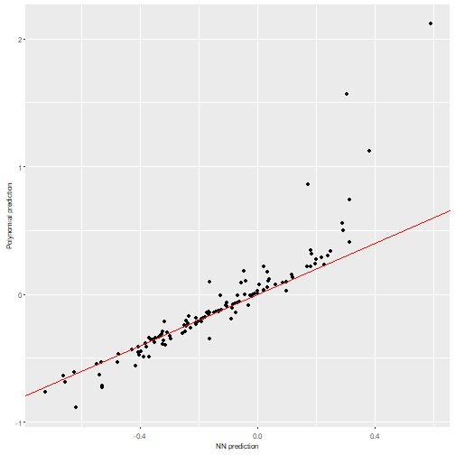

- Another convenient plot to show how the algorithm is affected by each layer can be obtained with `plot_taylor_and_activation_potentials()`, where the activation potentials at each neuron are computed and presented over the Taylor expansion approximation of the activation function at each layer. In this case, as we have not used constraints in the NN training, the activation potentials are not strictly centered around zero.


```r
plot_taylor_and_activation_potentials(data = train,
                                    weights_list = nn_weights,
                                    af_string_list = af_string_list,
                                    q_taylor_vector = q_taylor_vector,
                                    forced_max_Q = 3,
                                    my_max_norm = list("unconstrained",1))
#> [[1]]
```

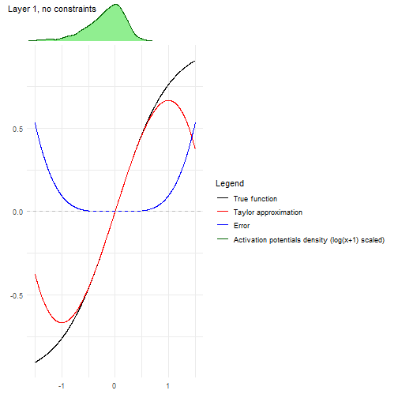

```
#> 
#> [[2]]
```

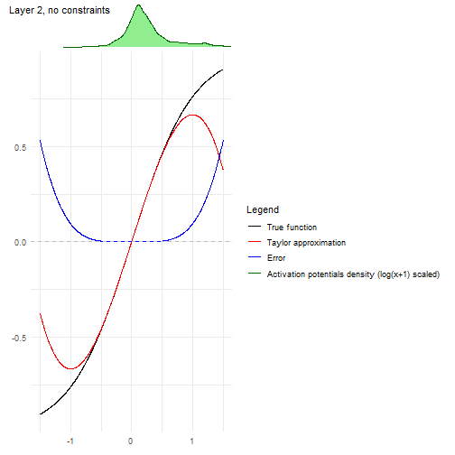

```
#> 
#> [[3]]
```


## Simple classification example

In this example, instead of a regression problem we will show a classification example, where a NN will be trained to classify species with the `iris` dataset, and then nn2poly will be employed to obtain a polynomial for each species.


### Data preparation

We will load the `iris` dataset from R and then scale it to have everything in the $[-1,1]$ interval and divide it in train and test datasets, in the same manner as the previous regression example.


```r
# Load the data
data(iris)

# Change response to numeric. In this case, Species was already numeric,
# but this step is needed if it is a factor variable.
iris$Species <- as.numeric(iris$Species)

# Define dimension p (number of predictor variables)
p <- dim(iris)[2] - 1

# Define objective classes
n_class <- max(iris[,(p+1)])

# Move objective classes from (1:3) to (0:2), needed for tensorflow
iris[,(p+1)] <- iris[,(p+1)] - 1
```


```r
# Scale the data in the [-1,1] interval and separate train and test
# Only the predictor variables are scaled, not the response as those will be
# the different classes.
iris_x <- iris[,-(p+1)]
maxs <- apply(iris_x, 2, max)
mins <- apply(iris_x, 2, min)
data_x_scaled <- as.data.frame(scale(iris_x, center = mins + (maxs - mins) / 2, scale = (maxs - mins) / 2))
data <- cbind(data_x_scaled, iris[,(p+1)])

# Divide in train (0.75) and test (0.25)
index <- sample(1:nrow(data), round(0.75 * nrow(data)))
train <- data[index, ]
test <- data[-index, ]

train_x <- as.matrix(train[,-(p+1)])
train_y <- as.matrix(train[,(p+1)])

test_x <- as.matrix(test[,-(p+1)])
test_y <- as.matrix(test[,(p+1)])
```


### Original neural network

We can now train the NN, following the same procedure as in the regression problem.

----
*Note*: It is important to note that in order to avoid asymptotic behavior of the method, it is useful to impose some kind of constraint when training the neural network weights. This is covered in `vignette("nn2poly-02-constraints")`.
----

First, we build the model. Note that in this case the NN has a linear output with the same number of neurons as the number of classes to predict (3 species). Then, the linear output will be transformed in a probability to find the most probable class but this step is done after training. Therefore, nn2poly will be used to obtain a polynomial that approximates this nn with linear outputs and then its results will also be transformed ito predict the highest probability class.


```r
nn <- keras_model_sequential()

nn %>% layer_dense(units = 100,
                  activation = "tanh",
                  input_shape = p)

nn %>% layer_dense(units = 100,
                  activation = "tanh")

nn %>% layer_dense(units = n_class)

nn
#> Model: "sequential_13"
#> __________________________________________________________________________________________________________________________
#>  Layer (type)                                         Output Shape                                     Param #            
#> ==========================================================================================================================
#>  dense_17 (Dense)                                     (None, 100)                                      500                
#>  dense_18 (Dense)                                     (None, 100)                                      10100              
#>  dense_19 (Dense)                                     (None, 3)                                        303                
#> ==========================================================================================================================
#> Total params: 10,903
#> Trainable params: 10,903
#> Non-trainable params: 0
#> __________________________________________________________________________________________________________________________
```


Compile the model:


```r
compile(nn,
        loss = loss_sparse_categorical_crossentropy(from_logits = TRUE),
        optimizer = optimizer_adam(),
        metrics = "accuracy")
```

And train it:


```r
history <- fit(nn,
               train_x,
               train_y,
               verbose = 0,
               epochs = 200,
               validation_split = 0.3
)
```

We can visualize the training process:


```r
plot(history)
```

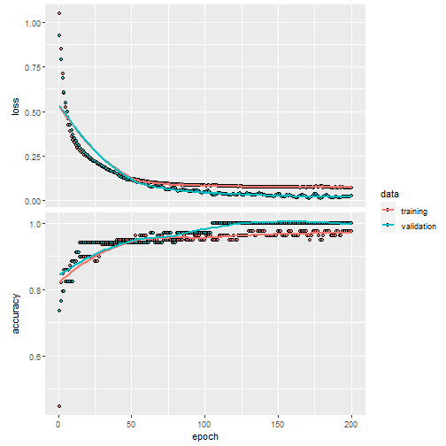

In this case, to asses the NN accuracy we have to transform the nn output into a probability:


```r
probability_model <- keras_model_sequential() %>%
  nn() %>%
  layer_activation_softmax() %>%
  layer_lambda(k_argmax)
```

And predict the results for the test data:


```r
# Obtain the predicted classes with the NN to compare them
prediction_NN_class <- predict(probability_model, test_x)

# Also, the linear output can be predicted before the probability model
prediction_NN <- predict(nn, test_x)
```
We can use here a confusion matrix to visualize the results, where we can see that the NN correctly predicts the classes of each observation:


```r
# Create a confusion matrix
cm <- caret::confusionMatrix(as.factor(prediction_NN_class), as.factor(test_y))
cm
#> Confusion Matrix and Statistics
#> 
#>           Reference
#> Prediction  0  1  2
#>          0 15  0  0
#>          1  0 11  0
#>          2  0  0 12
#> 
#> Overall Statistics
#>                                      
#>                Accuracy : 1          
#>                  95% CI : (0.9075, 1)
#>     No Information Rate : 0.3947     
#>     P-Value [Acc > NIR] : 4.568e-16  
#>                                      
#>                   Kappa : 1          
#>                                      
#>  Mcnemar's Test P-Value : NA         
#> 
#> Statistics by Class:
#> 
#>                      Class: 0 Class: 1 Class: 2
#> Sensitivity            1.0000   1.0000   1.0000
#> Specificity            1.0000   1.0000   1.0000
#> Pos Pred Value         1.0000   1.0000   1.0000
#> Neg Pred Value         1.0000   1.0000   1.0000
#> Prevalence             0.3947   0.2895   0.3158
#> Detection Rate         0.3947   0.2895   0.3158
#> Detection Prevalence   0.3947   0.2895   0.3158
#> Balanced Accuracy      1.0000   1.0000   1.0000
```


### Using nn2poly to obtain  the polynomial

After the NN has been trained, we need to extract and reshape the parameters as explained in the regression case:


```r
keras_weights <- keras::get_weights(nn)

# Due to keras giving weights separated from the bias, we have twice the
# elements that we want:
n <- length(keras_weights)/2
nn_weights <- vector(mode = "list", length = n)
for (i in 1:n){
  nn_weights[[i]] <- rbind(keras_weights[[2*i]], keras_weights[[2*i-1]])
}
```


The activation functions that we used can be stored as:


```r
af_string_list <- list("tanh","tanh", "linear")
```


And finally the order of the Taylor approximation that we are going to choose is 8 at each hidden layer. (The final polynomial order will be limited by `forced_max_Q=3`)


```r
q_taylor_vector <- c(8, 8,  1)
```

When the input is in the desired shape, the nn2poly method can be applied:


```r
final_poly <- nn2poly_algorithm(
  weights_list = nn_weights,
  af_string_list = af_string_list,
  q_taylor_vector = q_taylor_vector,
  store_coeffs = FALSE,
  forced_max_Q = 3
)
```


We can have a glimpse at how the coefficients of the polynomial are stored. As explained before, it has an structure as a list with labels and values. In this case, as we have 3 output polynomials (one per output neuron), the values are stored as a matrix with 3 rows, each one corresponding to the final polynomial at each neuron.


```r
final_poly
#> $labels
#> $labels[[1]]
#> [1] 0
#> 
#> $labels[[2]]
#> [1] 1
#> 
#> $labels[[3]]
#> [1] 2
#> 
#> $labels[[4]]
#> [1] 3
#> 
#> $labels[[5]]
#> [1] 4
#> 
#> $labels[[6]]
#> [1] 1 1
#> 
#> $labels[[7]]
#> [1] 1 2
#> 
#> $labels[[8]]
#> [1] 1 3
#> 
#> $labels[[9]]
#> [1] 1 4
#> 
#> $labels[[10]]
#> [1] 2 2
#> 
#> $labels[[11]]
#> [1] 2 3
#> 
#> $labels[[12]]
#> [1] 2 4
#> 
#> $labels[[13]]
#> [1] 3 3
#> 
#> $labels[[14]]
#> [1] 3 4
#> 
#> $labels[[15]]
#> [1] 4 4
#> 
#> $labels[[16]]
#> [1] 1 1 1
#> 
#> $labels[[17]]
#> [1] 1 1 2
#> 
#> $labels[[18]]
#> [1] 1 1 3
#> 
#> $labels[[19]]
#> [1] 1 1 4
#> 
#> $labels[[20]]
#> [1] 1 2 2
#> 
#> $labels[[21]]
#> [1] 1 2 3
#> 
#> $labels[[22]]
#> [1] 1 2 4
#> 
#> $labels[[23]]
#> [1] 1 3 3
#> 
#> $labels[[24]]
#> [1] 1 3 4
#> 
#> $labels[[25]]
#> [1] 1 4 4
#> 
#> $labels[[26]]
#> [1] 2 2 2
#> 
#> $labels[[27]]
#> [1] 2 2 3
#> 
#> $labels[[28]]
#> [1] 2 2 4
#> 
#> $labels[[29]]
#> [1] 2 3 3
#> 
#> $labels[[30]]
#> [1] 2 3 4
#> 
#> $labels[[31]]
#> [1] 2 4 4
#> 
#> $labels[[32]]
#> [1] 3 3 3
#> 
#> $labels[[33]]
#> [1] 3 3 4
#> 
#> $labels[[34]]
#> [1] 3 4 4
#> 
#> $labels[[35]]
#> [1] 4 4 4
#> 
#> 
#> $values
#>            [,1]       [,2]      [,3]       [,4]      [,5]       [,6]        [,7]       [,8]       [,9]      [,10]
#> [1,]  0.8657658 -1.7300284  8.113782 -10.717649 -7.525810  0.1469271 -0.70277557  0.8939304  0.5885493  0.1100270
#> [2,]  5.4942742  1.4966233 -1.085263  -1.835088 -3.184985 -0.2746923  0.04573656  0.6527696  0.8150438 -0.8027244
#> [3,] -5.7575579 -0.5725639 -4.417216   8.945973  8.171859  0.2144595  0.33243746 -1.0557353 -1.0806295  0.6099637
#>           [,11]     [,12]     [,13]     [,14]     [,15]         [,16]      [,17]       [,18]       [,19]      [,20]
#> [1,]  0.4881656  1.068435 -1.166918 -2.792616 -1.501065  0.1063938930 -0.4377667  0.51825850  0.34801827 -0.4742372
#> [2,]  2.7916732  2.479559 -3.668994 -7.058366 -3.785811 -0.0600402544  0.1777157 -0.06871239  0.02029091  0.1880001
#> [3,] -2.6275450 -2.659728  3.825817  7.535975  4.007151  0.0008082067  0.1119611 -0.25966474 -0.25119710  0.1195640
#>           [,21]      [,22]       [,23]      [,24]      [,25]      [,26]      [,27]      [,28]      [,29]     [,30]
#> [1,] -1.0910061 -0.5866069  0.57747843  0.3071512  0.4076099 -1.0644389  3.6230229  2.3926840  3.7525210 -6.062567
#> [2,]  0.7459916  0.5918715  0.06005741 -1.4353904  0.1645449  0.2718333 -0.6268611 -0.1363726 -0.4302278 -1.263415
#> [3,] -0.3287014 -0.3277693 -0.41444497  1.1755901 -0.4089281  0.4415258 -1.7749913 -1.4421963 -2.0169330  4.834294
#>            [,31]      [,32]     [,33]     [,34]     [,35]
#> [1,]  2.50018436  2.2998056  4.735468  4.741073  1.159419
#> [2,]  0.07348067  0.8013098  3.284242  3.329447  1.498424
#> [3,] -1.67965325 -2.0488358 -5.474633 -5.517897 -1.817963
```

### Obtaining polynomial predictions

As said before, the obtained polynomial represents the neural network before including the softmax function and computing the class assigned to each observation. Then, we need to define again a keras sequential model that includes the class computation from the polynomial output. This polynomial output is obtained with `eval_poly()`, in this case in matrix form, as the 3 polynomials are evaluated at the same time:


```r

# Obtain the predicted values for the test data with our Polynomial Regression
prediction_poly_matrix <- eval_poly(x = test_x, poly = final_poly)

# Define probability model with keras fro the polynomial outputs
probability_poly <- keras_model_sequential() %>%
  layer_activation_softmax() %>%
  layer_lambda(k_argmax)

# Class prediction with the polynomial outputs
prediction_poly_class <- predict(probability_poly,t(prediction_poly_matrix))
```


### Visualising the results

Again, a confusion matrix is useful to visualize the predictions, in this case we are comparing the polynomial predictions with the NN predictions.


```r

# Confussion matrix between NN class prediction and polynomial class prediction
cm <- caret::confusionMatrix(as.factor(prediction_NN_class), as.factor(prediction_poly_class))
cm
#> Confusion Matrix and Statistics
#> 
#>           Reference
#> Prediction  0  1  2
#>          0 14  0  1
#>          1  0 11  0
#>          2  0  0 12
#> 
#> Overall Statistics
#>                                           
#>                Accuracy : 0.9737          
#>                  95% CI : (0.8619, 0.9993)
#>     No Information Rate : 0.3684          
#>     P-Value [Acc > NIR] : 2.196e-15       
#>                                           
#>                   Kappa : 0.9603          
#>                                           
#>  Mcnemar's Test P-Value : NA              
#> 
#> Statistics by Class:
#> 
#>                      Class: 0 Class: 1 Class: 2
#> Sensitivity            1.0000   1.0000   0.9231
#> Specificity            0.9583   1.0000   1.0000
#> Pos Pred Value         0.9333   1.0000   1.0000
#> Neg Pred Value         1.0000   1.0000   0.9615
#> Prevalence             0.3684   0.2895   0.3421
#> Detection Rate         0.3684   0.2895   0.3158
#> Detection Prevalence   0.3947   0.2895   0.3158
#> Balanced Accuracy      0.9792   1.0000   0.9615
```

We can also compare the linear output of the NN with each polynomial output, before computing the assigned class. In this case we can see that even when the classes were correctly assigned, the linear output is not so well approximated by the polynomial. This is due to this example being computed without any kind of constraints on the NN, problem that is solved in `vignette("nn2poly-02-constraints")`:


```r
for (i in 1:3){
  print(
    plot_diagonal(x_axis =  prediction_NN[,i],
                  y_axis =  prediction_poly_matrix[i,],
                  xlab = "NN prediction",
                  ylab = "Polynomial prediction")
        )
}
```

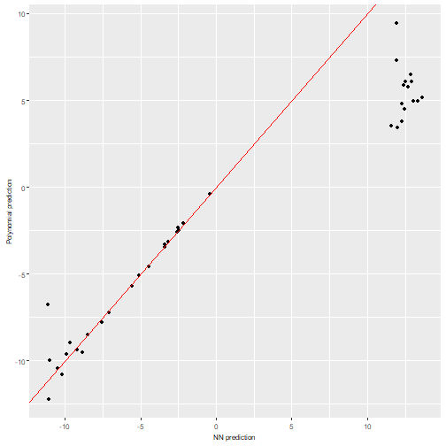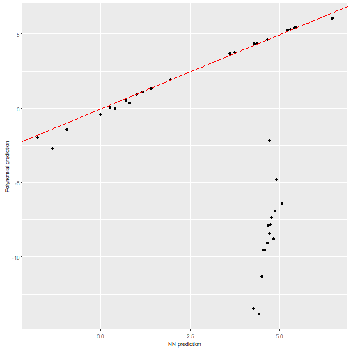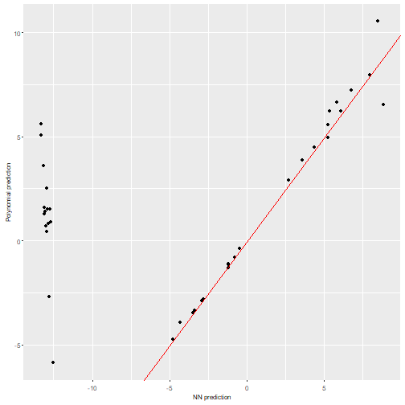

In order to try to identify where the problem is arising, we can use the synaptic potential plots. In this case it is easy to see that those activation potentials are widely spread over the x axis. Therefore, constraints are needed to keep them close to zero:


```r
plot_taylor_and_activation_potentials(data = train,
                                    weights_list = nn_weights,
                                    af_string_list = af_string_list,
                                    q_taylor_vector = q_taylor_vector,
                                    forced_max_Q = 3,
                                    my_max_norm = list("unconstrained",1))
#> [[1]]
```

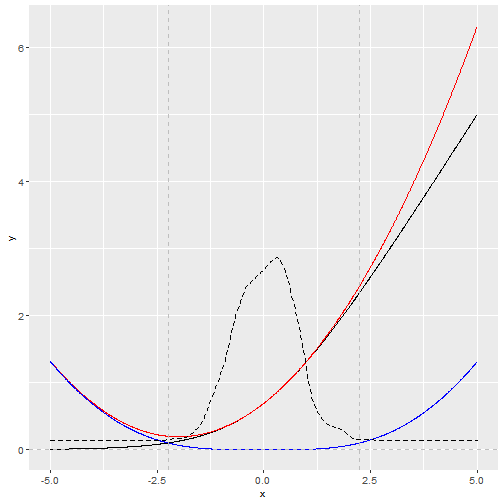

```
#> 
#> [[2]]
```

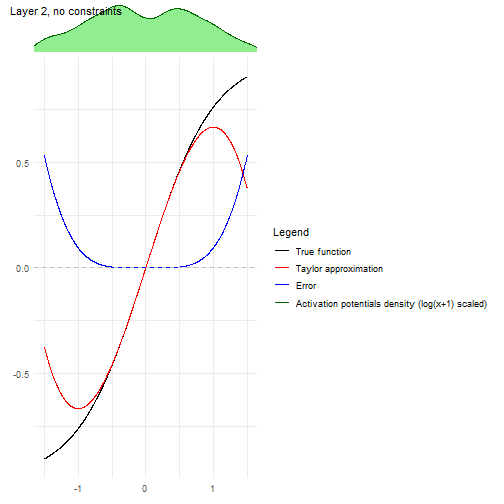

```
#> 
#> [[3]]
```

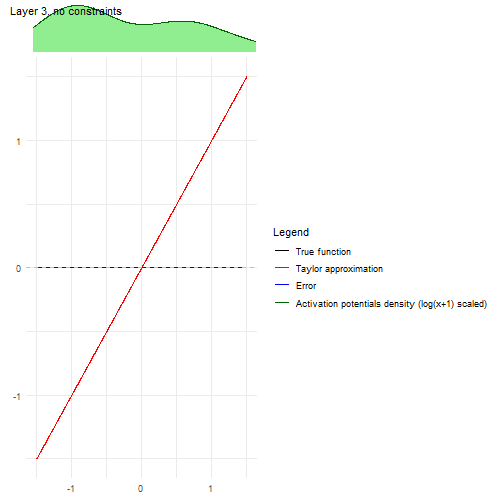


