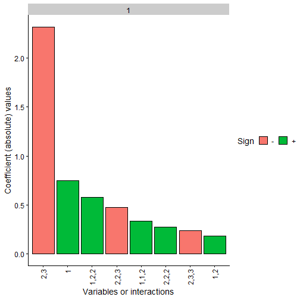

# Overall package goal

The main objective of `nn2poly` is to obtain a representation of a feed forward artificial neural network (like a multilayered perceptron) in terms of a polynomial representation. The coefficients of such polynomials are obtained by applying first a Taylor expansion at each activation function in the neural network. Then this expansions and the given neural network weights are joint using combinatorial properties, obtaining a final value for the polynomial coefficients.

More information with the theoretical insights about the underlying mathematical process used to build this relationship can be found in the following references:
  * Initial development of the idea for a single hidden layer neural network in this [article](https://doi.org/10.1016/j.neunet.2021.04.036) or its free access [arXiv preprint version](https://doi.org/10.48550/arXiv.2102.03865).
  * Extension to deeper layers and proper formulation of the _NN2Poly_ method in this [arXiv preprint](https://doi.org/10.48550/arXiv.2112.11397).


*Important remark 1*: The approximations made by the NN2poly method rely on Taylor expansions and therefore require some constraints to be imposed when training the original neural network. The implementation of these constraints depend on the deep learning framework used to train the neural networks. Currently, this package supports constraints implementation for *keras/tensorflow*, covered in `vignette("nn2poly-02-tensorflow-regression")` and `vignette("nn2poly-03-tensorflow-classification")`. Implementation for *pytorch* networks is in development. However, the `nn2poly` can work by default with any kind of neural network by manually feeding the neural network weights and activation functions to the algorithm. Therefore, `nn2poly` is not limited to a special deep learning framework.


# This vignette's goal

Here we present the basic behavior of `nn2poly` when used in its default version, without specifying any deep learning framework as explained in the previous remark. For that matter, we will showcase an example where we will get the weights from a trained neural network and manually create the object with the needed information to use `nn2poly`.

The result will be a polynomial that tries to approximate the neural network behavior. In this case the neural network training will not have any constraint imposed. Then, as explained previously, the final approximation by the polynomial may not be accurate enough.

This example is focused in the default version, but we need to build a NN under some framework, we will use `keras` and `tensorflow` for that matter. In any case, the needed parameters will be extracted and used under the default version of `nn2poly`, so this can be extrapolated to any other framework.


```r
library(nn2poly)
library(keras)

# This sets all needed seeds
tensorflow::set_random_seed(42)
```


# Simple regression example

This example will solve a regression problem using simulated data from a polynomial, which allows to control if the final polynomial coefficients obtained with `nn2poly` are similar to those from the polynomial that originates the data.

## Simulated data generation

We will simulate polynomial data as follows. First we define a polynomial using the format needed in `nn2poly`, specifically to use the function `eval_poly`, which consists of a list containing:
  * Labels: A list of integer vectors denoting the combinations of variables that appear on each term of the polynomial. Variables are numbered from `1` to `p` where `p` is the dimension of the problem. As an example, `c(1,1,3)` would represent the term $x_1^2x_3$
  * Values: Vector containing the numerical values of the coefficients denoted by labels. If multiple polynomials with the same terms but different coefficients want to be represented, a matrix can be employed, where each row is a polynomial.

Here we create the polynomial $4x_1 - 3 x_2x_3$:


```r

polynomial <- list()
polynomial$labels <- list(c(1), c(2,3))
polynomial$values <- c(4,-3)
```


With said polynomial, we can now generate the desired data that will train the NN for our example. We will employ a normal distribution to generate variables $x_1, x_2, x_3$ and also an error term $\epsilon$. Therefore, the response variable $y$ will be generated as: $y = 4x_1 - 3 x_2x_3 + \epsilon$


```r
# Define number of variables p and sample n
p <- 3
n_sample <- 500

# Predictor variables
X <- matrix(0,n_sample,p)
for (i in 1:p){
  X[,i] <- rnorm(n = n_sample,0,1)
}

# Response variable + small error term
Y <- as.vector(eval_poly(X,polynomial)) + stats::rnorm(n_sample, 0, 0.1)

# Store all as a data frame
data <- as.data.frame(cbind(X, Y))
head(data)
#>           V1           V2         V3          Y
#> 1  1.3709584  1.029140719  2.3250585 -1.7547416
#> 2 -0.5646982  0.914774868  0.5241222 -3.7107357
#> 3  0.3631284 -0.002456267  0.9707334  1.3609395
#> 4  0.6328626  0.136009552  0.3769734  2.4608270
#> 5  0.4042683 -0.720153545 -0.9959334 -0.6141076
#> 6 -0.1061245 -0.198124330 -0.5974829 -0.7455793
```

Then we will scale the data to have everything in the $[-1,1]$ interval and divide it in train and test datasets.


```r
# Data scaling
maxs <- apply(data, 2, max)
mins <- apply(data, 2, min)
data <- as.data.frame(scale(data, center = mins + (maxs - mins) / 2, scale = (maxs - mins) / 2))

# Divide in train (0.75) and test (0.25)
index <- sample(1:nrow(data), round(0.75 * nrow(data)))
train <- data[index, ]
test <- data[-index, ]

train_x <- as.matrix(train[,-(p+1)])
train_y <- as.matrix(train[,(p+1)])

test_x <- as.matrix(test[,-(p+1)])
test_y <- as.matrix(test[,(p+1)])
```


## Original neural network

With our simulated data ready, we can train our neural network. The method is expected to be applied to a given trained densely connected feed forward neural network (NN from now on), also referred as multilayer perceptron (MLP). Therefore, as explained before, the method used to train the NN can be used. Here we will use `keras`to train it, but we will manually build the needed object with the weights that has to be fed to the `nn2poly` algorithm **as if it was trained with any other framework**. For more information on the specific `keras` methods implemented in the package, please refer to `vignette("nn2poly-02-tensorflow-regression")` and `vignette("nn2poly-02-tensorflow-classification")`.


*Note*: Once again, note that, in order to avoid asymptotic behavior of the method, it is important to impose some kind of constraints when training the neural network weights. Details on how to do this depend on the chosen deep learning framework and are covered in the next vignettes.


First, we build the model.


```r
nn <- keras_model_sequential()

nn %>% layer_dense(units = 10,
                  activation = "tanh",
                  input_shape = p)

nn %>% layer_dense(units = 10,
                  activation = "tanh")

nn %>% layer_dense(units = 1,
                  activation = "linear")

nn
#> Model: "sequential"
#> ________________________________________________________________________________________________________________________
#>  Layer (type)                                         Output Shape                                    Param #           
#> ========================================================================================================================
#>  dense (Dense)                                        (None, 10)                                      40                
#>  dense_1 (Dense)                                      (None, 10)                                      110               
#>  dense_2 (Dense)                                      (None, 1)                                       11                
#> ========================================================================================================================
#> Total params: 161
#> Trainable params: 161
#> Non-trainable params: 0
#> ________________________________________________________________________________________________________________________
```

Compile the model:


```r
compile(nn,
        loss = "mse",
        optimizer = optimizer_adam(),
        metrics = "mse")
```

And train it:


```r
history <- fit(nn,
               train_x,
               train_y,
               verbose = 0,
               epochs = 300,
               validation_split = 0.3
)
```

We can visualize the training process:


```r
plot(history)
```


And we can also visualize the NN predictions vs the original Y values.


```r
# Obtain the predicted values with the NN to compare them
prediction_NN <- predict(nn, test_x)

# Diagonal plot implemented in the package to quickly visualize and compare predictions
plot_diagonal(x_axis =  prediction_NN, y_axis =  test_y, xlab = "NN prediction", ylab = "Original Y")
```


*Note*: Recall that the NN performance is not addressed by `nn2poly`, meaning that this performance could be either good or bad and `nn2poly` still represent the NN behavior.

## Using nn2poly to obtain  the polynomial

After the NN has been trained, using any chosen method by the user, the parameters have to be extracted and reshaped, if needed, to match the expected input of the function `nn2poly_algorithm()`. 

This input should be an `object` formed by a list of matrices with a weight matrix at each layer. The weights matrices should be of dimension ((1+input) * output) where the first row corresponds to the bias vector, and the rest of the rows correspond to each of the ordered vector weights associated to each input. 

In that list, the name of each element has to be the activation function names of each layer. Currently supported activation functions are `"tanh", "sigmoid", "softplus", "linear"`.

Particularly, the `keras` framework by default separates kernel weights matrices of dimension (input * output) and bias vectors (1 * output), so we need to add the bias as the first row of a matrix ((1+input) * output).


```r
keras_weights <- keras::get_weights(nn)

# Due to keras giving weights separated from the bias, we have twice the
# elements that we want:
n <- length(keras_weights)/2
nn_weights <- vector(mode = "list", length = n)
for (i in 1:n){
  nn_weights[[i]] <- rbind(keras_weights[[2*i]], keras_weights[[2*i-1]])
}

# The activation functions stored as strings:
af_string_names <- c("tanh","tanh", "linear")

weights_object <- nn_weights
names(weights_object) <- af_string_names

weights_object
#> $tanh
#>            [,1]       [,2]      [,3]        [,4]        [,5]       [,6]       [,7]        [,8]        [,9]       [,10]
#> [1,]  0.2637966 -0.1632335 0.4649245 -0.20589803  0.04730094 -0.3763387 -0.2124885 -0.08747434 -0.07051360 -0.37202930
#> [2,]  0.2385524  0.1342811 0.2513933  0.48018309 -0.47788176  0.1631715  0.6607828 -0.31218216 -0.01426336 -0.01626668
#> [3,] -0.7742428 -0.1097567 0.8174284  0.08418242  0.06163564  0.7477616 -0.8533844 -0.48116657  0.04514860 -0.70131820
#> [4,] -0.6955228  0.5266028 0.5572206 -0.46307948  0.48515409 -0.7743985  0.1162070  0.35274017  0.04112899 -0.56946415
#> 
#> $tanh
#>              [,1]        [,2]        [,3]        [,4]        [,5]       [,6]        [,7]        [,8]        [,9]
#>  [1,] -0.06261473  0.01255261  0.42954829  0.06141516  0.08550595  0.2265693  0.08071607  0.16983804  0.08445328
#>  [2,]  0.61023968 -0.15460493  0.32420215  0.16633785  0.25600886 -0.2739864  0.06122208 -0.04379337 -0.57018125
#>  [3,] -0.25070983 -0.05766810 -0.50344008  0.13009298 -0.03173310 -0.4047118  0.28472036  0.23372132 -0.47447795
#>  [4,]  0.40872586  0.46675542  0.11527456  0.43078154  0.15864335  0.6346628  0.01778316 -0.29318872  0.07777876
#>  [5,] -0.24814591  0.01059229  0.40011716  0.27607894 -0.46360433 -0.3692199 -0.53746992 -0.42425549 -0.48620722
#>  [6,] -0.26658243  0.51526904 -0.09131107  0.37373766  0.26082405  0.4299564 -0.41601449 -0.25669649 -0.28299403
#>  [7,]  0.51186675  0.12881947  0.67951459 -0.17605777  0.15393135  0.4613117 -0.22281407  0.40243641 -0.12623918
#>  [8,]  0.40394908 -0.42659599 -0.98550946 -0.15839998  0.02221864  0.3011585 -0.04859665 -0.38288346  0.25072047
#>  [9,]  0.50324774  0.11122702 -0.84318024 -0.02784178  0.31848624  0.2643846  0.48137835 -0.40863025  0.01616014
#> [10,]  0.27406499 -0.11159007  0.02285146  0.35646623  0.25075704 -0.1359648 -0.32286894  0.09449039 -0.06011314
#> [11,] -0.52268207  0.45537508 -0.56030786  0.49129054 -0.03669148 -0.7891714  0.14410253 -0.21469988  0.24569559
#>               [,10]
#>  [1,]  0.0732324421
#>  [2,] -0.3144004941
#>  [3,]  0.0003889628
#>  [4,] -0.0302867368
#>  [5,] -0.1922566146
#>  [6,] -0.2540818155
#>  [7,] -0.4014825821
#>  [8,] -0.3935797811
#>  [9,] -0.5411312580
#> [10,] -0.4011713266
#> [11,]  0.3822859824
#> 
#> $linear
#>              [,1]
#>  [1,] -0.07251097
#>  [2,]  0.95829737
#>  [3,] -0.07316440
#>  [4,] -0.35980642
#>  [5,] -0.43944517
#>  [6,] -0.07012334
#>  [7,]  0.60509491
#>  [8,] -0.66404337
#>  [9,] -0.04713812
#> [10,] -0.79189116
#> [11,] -0.91330308
```

Additionally, there are other parameters affecting properties of the algorithm:

* `q_taylor_vector`: A vector of integers containing the order of the Taylor expansion performed at each layer. If the output layer has a linear activation function, then the last value should be 1.


```r
q_taylor_vector <- c(8, 8,  1)
```

* `forced_max_Q`: (optional value) An integer value denoting the maximum order of the terms computed in the polynomial. Usually 2 or 3 should be enough in practice. Note that higher orders suppose an explosion in the possible combinations. If the user does not provide a value, the polynomial order grows multiplicatively with the Taylor order at each hidden layer, therefore its better to start with low values.

When the input is in the desired shape, the nn2poly method can be applied:


```r

final_poly <- nn2poly(object = weights_object,
                      q_taylor_vector = q_taylor_vector,
                      forced_max_Q = 3)
```


We can have a glimpse at how the coefficients of the polynomial are stored. Note that the structure is the same as explained for the polynomial that generated the data, as a list with labels and values. In this case, the obtained polynomial is up to order 3.


```r
final_poly
#> $labels
#> $labels[[1]]
#> [1] 0
#> 
#> $labels[[2]]
#> [1] 1
#> 
#> $labels[[3]]
#> [1] 2
#> 
#> $labels[[4]]
#> [1] 3
#> 
#> $labels[[5]]
#> [1] 1 1
#> 
#> $labels[[6]]
#> [1] 1 2
#> 
#> $labels[[7]]
#> [1] 1 3
#> 
#> $labels[[8]]
#> [1] 2 2
#> 
#> $labels[[9]]
#> [1] 2 3
#> 
#> $labels[[10]]
#> [1] 3 3
#> 
#> $labels[[11]]
#> [1] 1 1 1
#> 
#> $labels[[12]]
#> [1] 1 1 2
#> 
#> $labels[[13]]
#> [1] 1 1 3
#> 
#> $labels[[14]]
#> [1] 1 2 2
#> 
#> $labels[[15]]
#> [1] 1 2 3
#> 
#> $labels[[16]]
#> [1] 1 3 3
#> 
#> $labels[[17]]
#> [1] 2 2 2
#> 
#> $labels[[18]]
#> [1] 2 2 3
#> 
#> $labels[[19]]
#> [1] 2 3 3
#> 
#> $labels[[20]]
#> [1] 3 3 3
#> 
#> 
#> $values
#>            [,1]      [,2]       [,3]        [,4]       [,5]       [,6]        [,7]      [,8]      [,9]      [,10]
#> [1,] -0.1617715 0.7475098 0.09908831 -0.08050417 0.07277049 0.03545956 0.009334022 0.3035036 -2.559723 0.02124509
#>            [,11]     [,12]      [,13]     [,14]       [,15]      [,16]     [,17]     [,18]      [,19]       [,20]
#> [1,] -0.08924709 0.2939184 0.01080101 0.6197476 -0.04956815 0.07802355 0.5294107 -1.012448 -0.7079898 -0.05140071
#> 
#> attr(,"class")
#> [1] "nn2poly"
```
Note that the output has the `nn2poly` class.

## Obtaining polynomial predictions

After obtaining the polynomial coefficients, we can use them to predict the response variable $Y$. This is done by employing function `predcit`on an `nn2poly` object and providing the new data to predict.


```r

# Obtain the predicted values for the test data with our polynomial
prediction_poly <- predict(object = final_poly,
                           newdata = test_x)
```


## Visualizing the results

It is advisable to always check that the predictions obtained with the new polynomial do not differ too much from the original neural network predictions (and in case they differ, we can also try to find why by checking the Taylor expansions). To help with that, a couple of functions are included that allow us to plot the results.

A simple plot comparing the polynomial and NN predictions can be obtained with `plot_diagonal()`, where the red diagonal line represents where a perfect relationship between the NN and the polynomial predictions would be obtained. In this example, as the theoretical weights constraints have not been imposed, we can observe how the approximation is not perfect.


```r

plot_diagonal(x_axis =  prediction_NN, y_axis =  prediction_poly, xlab = "NN prediction", ylab = "Polynomial prediction")
```


We can also plot the $n$ most important coefficients in absolute value to compare which variables or interactions are more relevant in the polynomial. Note that, as data should be scaled to the $[-1,1]$ interval, interactions of order 2 or higher would usually need a higher absolute value than the lower order coefficients to be more relevant.

In this case we can see how the coefficients differ from the original polynomial $4x_1 - 3 x_2x_3$, as there were no constraints on the neural network weights training.


```r
plot_n_important_coeffs(final_poly, 8)
```




Another convenient plot to show how the algorithm is affected by each layer can be obtained with `plot_taylor_and_activation_potentials()`, where the activation potentials at each neuron are computed and presented over the Taylor expansion approximation of the activation function at each layer. 

In this case, as we have not used constraints in the NN training, the activation potentials are not strictly centered around zero.


```r
plot_taylor_and_activation_potentials(object = nn,
                                      data = train,
                                    q_taylor_vector = q_taylor_vector,
                                    forced_max_Q = 3,
                                    my_max_norm = list("unconstrained",1))
#> [[1]]
```


```
#> 
#> [[2]]
```


```
#> 
#> [[3]]
```


