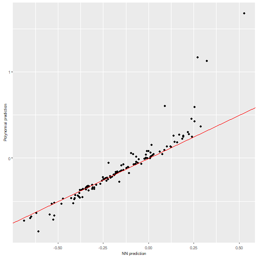
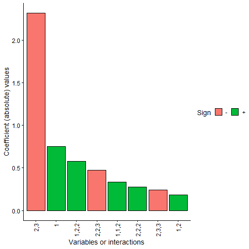

# `nn2poly` package goal

The main objective of `nn2poly` is to obtain a representation of a feed forward artificial neural network (like a multilayered perceptron) in terms of a polynomial representation. The coefficients of such polynomials are obtained by applying first a Taylor expansion at each activation function in the neural network. Then, this expansions and the given neural network weights are joint using combinatorial properties, obtaining a final value for the polynomial coefficients. The main goal of this new representation is to obtain an interpretable model, serving thus as an eXplainable Artificial Intelligence (XAI) tool to overcome the black box nature of neural networks by means of interpreting the effect of those obtained polynomial coefficients.

More information with the theoretical insights about the underlying mathematical process used to build this relationship can be found in the following references:

- Pablo Morala, J. Alexandra Cifuentes, Rosa E. Lillo, Iñaki Ucar (2021).
  "Towards a mathematical framework to inform neural network modelling via polynomial regression."
  _Neural Networks_, *142*, 57-72.
  doi: [10.1016/j.neunet.2021.04.036](https://doi.org/10.1016/j.neunet.2021.04.036)

- Pablo Morala, J. Alexandra Cifuentes, Rosa E. Lillo, Iñaki Ucar (2023).
  "NNN2Poly: A Polynomial Representation for Deep Feed-Forward Artificial Neural Networks."
  _IEEE Transactions on Neural Networks and Learning Systems_, (Early Access).
  doi: [10.1109/TNNLS.2023.3330328](https://doi.org/10.1109/TNNLS.2023.3330328)

> *Important remark*: The approximations made by NN2Poly rely on Taylor expansions and therefore require some constraints to be imposed when training the original neural network in order to have those expansions controlled. The implementation of these constraints depends on the deep learning framework used to train the neural networks. Frameworks currently supported are *tensorflow* and *torch*. Details on how constraints are applied on each framework are covered in `vignette("nn2poly-02-supported-DL-frameworks")`. However, `nn2poly` can work by default with any kind of neural network by manually feeding the neural network weights and activation functions to the algorithm. Therefore, `nn2poly` is not limited to any of the supported deep learning frameworks.

# This vignette: a first example

In this vignette we present the basic behavior of `nn2poly` when used in its default version, without specifying any deep learning framework as explained in the previous remark. For that matter, we will showcase an example where we will get the weights from a trained neural network and manually create the object with the needed information to use `nn2poly`.

The result will be a polynomial that tries to approximate the neural network behavior. In this case the neural network training will not have any constraints imposed. Then, as explained previously, the final approximation by the polynomial may not be accurate enough.

This example is focused in the default version, but, as we need to build a NN under some framework, we will use `keras` and `tensorflow` for that matter. In any case, the needed parameters will be extracted and used under the default version of `nn2poly`, so this can be extrapolated to any other framework.

In particular, we will solve a really simple regression problem using simulated data from a polynomial, which allows us to have a ground truth and control if the final polynomial coefficients obtained with `nn2poly` are similar to those from the polynomial that originates the data.

> *Note*: For a classification example please refer to `vignette("nn2poly-03-classification-example")`

## Polynomial structure in `nn2poly`


```r
library(nn2poly)
set.seed(42)
```

As the final output of using `nn2poly` on a neural network is a polynomial (or several ones in classification problems), the package uses a certain structure to represent those polynomials and it also provides `nn2poly:::eval_poly()`, a function to evaluate polynomials in that structure. As we will use it to generate the simulated data in this example, we first define a polynomial using the format needed in `nn2poly`, which consists of a list containing:
  * Labels: A list of integer vectors denoting the combinations of variables that appear on each term of the polynomial. Variables are numbered from `1` to `p` where `p` is the dimension of the problem. As an example, `c(1,1,3)` would represent the term $x_1^2x_3$. An special case is the intercept term, which is represented by `0`
  * Values: Vector containing the numerical values of the coefficients denoted by labels. If multiple polynomials with the same labels but different coefficient values are wanted, a matrix can be employed, where each row represents a polynomial.

Here we create the polynomial $4x_1 - 3 x_2x_3$:


```r

polynomial <- list()
polynomial$labels <- list(c(1), c(2,3))
polynomial$values <- c(4,-3)
```

## Simulated data

With said polynomial, we can now generate the desired data that will train the NN for our example. We will employ a normal distribution to generate variables $x_1, x_2, x_3$ and also an error term $\epsilon$. Therefore, the response variable $y$ will be generated as: $y = 4x_1 - 3 x_2x_3 + \epsilon$


```r
# Define number of variables and sample size
p <- 3
n_sample <- 500

# Predictor variables
X <- matrix(0,n_sample,p)
for (i in 1:p){
  X[,i] <- rnorm(n = n_sample,0,1)
}

# Response variable + small error term
Y <- nn2poly:::eval_poly(poly = polynomial, newdata = X) +
  stats::rnorm(n_sample, 0, 0.1)

# Store all as a data frame
data <- as.data.frame(cbind(X, Y))
head(data)
#>           V1           V2         V3          Y
#> 1  1.3709584  1.029140719  2.3250585 -1.7547416
#> 2 -0.5646982  0.914774868  0.5241222 -3.7107357
#> 3  0.3631284 -0.002456267  0.9707334  1.3609395
#> 4  0.6328626  0.136009552  0.3769734  2.4608270
#> 5  0.4042683 -0.720153545 -0.9959334 -0.6141076
#> 6 -0.1061245 -0.198124330 -0.5974829 -0.7455793
```

Then we will scale the data to have everything in the $[-1,1]$ interval and divide it in train and test.


```r
# Data scaling to [-1,1]
maxs <- apply(data, 2, max)
mins <- apply(data, 2, min)
data <- as.data.frame(scale(data, center = mins + (maxs - mins) / 2, scale = (maxs - mins) / 2))

# Divide in train (0.75) and test (0.25)
index <- sample(1:nrow(data), round(0.75 * nrow(data)))
train <- data[index, ]
test <- data[-index, ]

train_x <- as.matrix(train[,-(p+1)])
train_y <- as.matrix(train[,(p+1)])

test_x <- as.matrix(test[,-(p+1)])
test_y <- as.matrix(test[,(p+1)])
```


## Original neural network

With our simulated data ready, we can train our neural network. The method is expected to be applied to a given trained densely connected feed forward neural network (NN from now on), also referred as multilayer perceptron (MLP). Therefore, as explained before, any method can be used to train the NN as `nn2poly` only needs the weights and activation functions.

Here we will use `keras`/`tensorflow` to train it, but we will manually build the needed object with the weights and activation functions that has to be fed to the `nn2poly` algorithm **to show how to do it as if it was trained with any other framework**. However, recall that `keras`/`tensorflow` and `luz`/`torch` models have specific support in `nn2poly` with a more user-friendly approach than the default case covered here where we manually build the weights and activation functions object. For more information on the supported frameworks refer to `vignette("nn2poly-02-supported-DL-frameworks")`.


```r
library(keras)

# This sets all needed seeds
tensorflow::set_random_seed(42)
```

First, we build the model.


```r
nn <- keras_model_sequential()

nn %>% layer_dense(units = 10,
                  activation = "tanh",
                  input_shape = p)

nn %>% layer_dense(units = 10,
                  activation = "tanh")

nn %>% layer_dense(units = 1,
                  activation = "linear")

nn
#> Model: "sequential"
#> ____________________________________________________________________________________________________________________
#>  Layer (type)                                       Output Shape                                  Param #           
#> ====================================================================================================================
#>  dense (Dense)                                      (None, 10)                                    40                
#>  dense_1 (Dense)                                    (None, 10)                                    110               
#>  dense_2 (Dense)                                    (None, 1)                                     11                
#> ====================================================================================================================
#> Total params: 161 (644.00 Byte)
#> Trainable params: 161 (644.00 Byte)
#> Non-trainable params: 0 (0.00 Byte)
#> ____________________________________________________________________________________________________________________
```

Compile the model:


```r
compile(nn,
        loss = "mse",
        optimizer = optimizer_adam(),
        metrics = "mse")
```

And train it:


```r
history <- fit(nn,
               train_x,
               train_y,
               verbose = 0,
               epochs = 250,
               validation_split = 0.3
)
```

We can visualize the training process:


```r
plot(history)
```


And we can also visualize the NN predictions vs the original Y values.


```r
# Obtain the predicted values with the NN to compare them
prediction_NN <- predict(nn, test_x)
#> 4/4 - 0s - 64ms/epoch - 16ms/step

# Diagonal plot implemented in the package to quickly visualize and compare predictions
nn2poly:::plot_diagonal(x_axis =  prediction_NN, y_axis =  test_y, xlab = "NN prediction", ylab = "Original Y")
```


> *Note*: Recall that the NN performance is not addressed by `nn2poly`, meaning that this performance could be either good or bad and `nn2poly`'s goal would still be to represent the NN behavior and predict as good or as bad as the NN.

## Building the needed input for default `nn2poly`

Once the NN has been trained, using any chosen method by the user, the default version of using `nn2poly` requires to set up the weight matrices and activation functions from the neural network in the expected input form. This should be a list of matrices such that:

- There is a weight matrix per layer. The weights matrices should be of dimension $((1+input) * output)$ where the first row corresponds to the bias vector, and the rest of the rows correspond to each of the ordered vector weights associated to each neuron input.
- The name of each element in the list (i.e. each weight matrix) has to be the name of the activation function employed at that layer. Currently supported activation functions are `"tanh", "sigmoid", "softplus", "linear"`.
- Then, the total size of the list has to be equal to the number of hidden layers plus one.

In particular, the `keras` framework by default separates kernel weights matrices of dimension (input * output) and bias vectors (1 * output), so we need to add the bias as the first row of a matrix ((1+input) * output).

> *Note*: Please note again that `keras`/`tensorflow` and `luz`/`torch` models have specific support in `nn2poly` with a more user-friendly approach than manually building the weights and activation functions list. For more information on the supported frameworks refer to `vignette("nn2poly-02-supported-DL-frameworks")`.


```r
keras_weights <- keras::get_weights(nn)

# Due to keras giving weights separated from the bias, we have twice the
# elements that we want:
n <- length(keras_weights)/2
nn_weights <- vector(mode = "list", length = n)
for (i in 1:n){
  nn_weights[[i]] <- rbind(keras_weights[[2*i]], keras_weights[[2*i-1]])
}

# The activation functions stored as strings:
af_string_names <- c("tanh","tanh", "linear")

weights_object <- nn_weights
names(weights_object) <- af_string_names

weights_object
#> $tanh
#>            [,1]       [,2]      [,3]       [,4]        [,5]       [,6]       [,7]        [,8]        [,9]
#> [1,]  0.2468006 -0.1615576 0.4128721 -0.2022066  0.04867206 -0.3397017 -0.1973533 -0.08864177 -0.06979843
#> [2,]  0.2653632  0.1291278 0.1464561  0.5171605 -0.47153816  0.1952459  0.6991890 -0.34414759 -0.01077842
#> [3,] -0.7783106 -0.1182964 0.8215331  0.0756740  0.06914742  0.7492308 -0.8363205 -0.46379340  0.04437404
#> [4,] -0.7159964  0.5072741 0.6033612 -0.4585148  0.49232438 -0.7474106  0.1091831  0.34101799  0.04305385
#>             [,10]
#> [1,] -0.359030366
#> [2,]  0.006373413
#> [3,] -0.698476076
#> [4,] -0.571668506
#> 
#> $tanh
#>              [,1]          [,2]        [,3]        [,4]        [,5]       [,6]        [,7]        [,8]
#>  [1,] -0.06682093  1.354177e-02  0.41062176  0.06204464  0.08612972  0.2199472  0.07406761  0.16231309
#>  [2,]  0.61209673 -1.587261e-01  0.33286688  0.16685191  0.25638032 -0.2960541  0.06451954 -0.04405669
#>  [3,] -0.24969149 -5.748887e-02 -0.46696794  0.12622431 -0.03608320 -0.3931088  0.28291187  0.24243380
#>  [4,]  0.38323382  4.771161e-01  0.11585876  0.44199020  0.16203447  0.6357560  0.01491554 -0.29491946
#>  [5,] -0.24755152  6.043483e-06  0.41534948  0.27495798 -0.46539015 -0.3829005 -0.53592098 -0.42729110
#>  [6,] -0.26591998  5.250556e-01 -0.10562975  0.37414369  0.26212201  0.4499114 -0.41681677 -0.25272584
#>  [7,]  0.49481559  1.359816e-01  0.67004895 -0.15929574  0.16280667  0.4475754 -0.20691858  0.40582910
#>  [8,]  0.40330765 -4.343324e-01 -0.92225003 -0.15942611  0.01812540  0.2977643 -0.04585903 -0.37514219
#>  [9,]  0.51166564  1.184353e-01 -0.82071930 -0.02945352  0.31787610  0.2762571  0.48814669 -0.39470875
#> [10,]  0.27744713 -1.118216e-01  0.02931483  0.35466376  0.24984393 -0.1250943 -0.32097501  0.09834206
#> [11,] -0.50523925  4.479433e-01 -0.55034703  0.48515356 -0.03854835 -0.8001245  0.15069254 -0.20994137
#>              [,9]        [,10]
#>  [1,]  0.08528626  0.074458212
#>  [2,] -0.57139808 -0.314788640
#>  [3,] -0.47687724 -0.002060457
#>  [4,]  0.09033196 -0.017912282
#>  [5,] -0.48928314 -0.197884247
#>  [6,] -0.28060704 -0.249755934
#>  [7,] -0.11089712 -0.387193263
#>  [8,]  0.24891976 -0.395170867
#>  [9,]  0.01584071 -0.538033605
#> [10,] -0.06148605 -0.403377086
#> [11,]  0.23820342  0.375222772
#> 
#> $linear
#>              [,1]
#>  [1,] -0.07325488
#>  [2,]  0.92378414
#>  [3,] -0.08239315
#>  [4,] -0.32572412
#>  [5,] -0.43841833
#>  [6,] -0.08093655
#>  [7,]  0.59904134
#>  [8,] -0.65850627
#>  [9,] -0.04606140
#> [10,] -0.79061949
#> [11,] -0.89735550
```

## Polynomial obtained with `nn2poly` from weights and activation functions

After setting up the NN information in our desired input shape, we are ready to employ `nn2poly`. The only last parameter that we need to specify is the final order of our desired polynomial, `max_order`. It should be an integer value denoting the maximum order of the terms computed in the polynomial. Usually 2 or 3 should be enough in real data and default value is set up to 2, capturing pairwise interactions. Note that higher orders suppose an explosion in the possible combinations of variables and therefore the number of terms in the polynomial.

In this example we will set `max_order = 3` and obtain our final polynomial:


```r

final_poly <- nn2poly(object = weights_object,
                      max_order = 3)
```

We can have a glimpse at how the coefficients of the polynomial are stored. Note that the structure is the same as explained for the polynomial that generated the data, as a list with labels and values. In this case, the obtained polynomial is up to order 3.


```r
final_poly
#> $labels
#> $labels[[1]]
#> [1] 0
#> 
#> $labels[[2]]
#> [1] 1
#> 
#> $labels[[3]]
#> [1] 2
#> 
#> $labels[[4]]
#> [1] 3
#> 
#> $labels[[5]]
#> [1] 1 1
#> 
#> $labels[[6]]
#> [1] 1 2
#> 
#> $labels[[7]]
#> [1] 1 3
#> 
#> $labels[[8]]
#> [1] 2 2
#> 
#> $labels[[9]]
#> [1] 2 3
#> 
#> $labels[[10]]
#> [1] 3 3
#> 
#> $labels[[11]]
#> [1] 1 1 1
#> 
#> $labels[[12]]
#> [1] 1 1 2
#> 
#> $labels[[13]]
#> [1] 1 1 3
#> 
#> $labels[[14]]
#> [1] 1 2 2
#> 
#> $labels[[15]]
#> [1] 1 2 3
#> 
#> $labels[[16]]
#> [1] 1 3 3
#> 
#> $labels[[17]]
#> [1] 2 2 2
#> 
#> $labels[[18]]
#> [1] 2 2 3
#> 
#> $labels[[19]]
#> [1] 2 3 3
#> 
#> $labels[[20]]
#> [1] 3 3 3
#> 
#> 
#> $values
#>               [,1]
#>  [1,] -0.152201327
#>  [2,]  0.750790396
#>  [3,]  0.096754449
#>  [4,] -0.055312169
#>  [5,]  0.087070907
#>  [6,]  0.184542875
#>  [7,]  0.056719718
#>  [8,]  0.117868180
#>  [9,] -2.316887421
#> [10,] -0.111600389
#> [11,] -0.106978125
#> [12,]  0.335722744
#> [13,]  0.007464716
#> [14,]  0.580397844
#> [15,] -0.072672555
#> [16,]  0.064910409
#> [17,]  0.274290026
#> [18,] -0.474785464
#> [19,] -0.242252638
#> [20,]  0.013870973
#> 
#> attr(,"class")
#> [1] "nn2poly"
```


## Predictions using the obtained polynomial

With the obtained polynomial coefficients, we can use them to predict the response variable $Y$ using the polynomial. This can be done using `predcit` on the output of `nn2poly` (object with class `"nn2poly"`) together with the desired values for the predictor variables.


```r

# Obtain the predicted values for the test data with our polynomial
prediction_poly <- predict(object = final_poly,
                           newdata = test_x)
```


## Visualizing the results

> *Note*: Once again note that, in order to avoid asymptotic behavior of the method, it is important to impose some kind of constraints when training the neural network weights, something which we are not doing here to simplify this first example. Details on how to do this depend on the chosen deep learning framework and are covered in the next vignettes.

It is advisable to always check that the predictions obtained with the new polynomial are close to the original NN predictions (and in case they differ, we can also try to find why by checking the Taylor expansions). To help with that, a couple of functions are included that allow us to plot the results.

A simple plot comparing the polynomial and NN predictions can be obtained with `nn2poly:::plot_diagonal()`, where the red diagonal line represents where a perfect relationship between the NN and the polynomial predictions would be obtained. In this example, as the theoretical weight constraints have not been imposed, we can observe how the approximation is not perfect.


```r

nn2poly:::plot_diagonal(x_axis =  prediction_NN, y_axis =  prediction_poly, xlab = "NN prediction", ylab = "Polynomial prediction")
```



We can also plot the $n$ most important coefficients in absolute value to compare which variables or interactions are more relevant in the polynomial. Note that, as data should be scaled to the $[-1,1]$ interval, interactions of order 2 or higher would usually need a higher absolute value than the lower order coefficients to be more relevant.

In this case we can see how the two most important obtained coefficients are `2,3` and `1`, precisely the two terms appearing in the original polynomial $4x_1 - 3 x_2x_3$. However, other interactions of order 3 appear to be also relevant, which is caused by the Taylor expansions not being controlled as we have not imposed constraints on the neural network weights training.


```r
plot(final_poly, n=8)
```




Another convenient plot to show how the algorithm is affected by each layer can be obtained with `nn2poly:::plot_taylor_and_activation_potentials()`, where the activation potentials at each neuron are computed and presented over the Taylor expansion approximation of the activation function at each layer.

In this case, as we have not used constraints in the NN training, the activation potentials are not strictly centered around zero.


```r
nn2poly:::plot_taylor_and_activation_potentials(object = nn,
                                                data = train,
                                                max_order = 3,
                                                constraints = FALSE)
#> [[1]]
```


```
#> 
#> [[2]]
```


```
#> 
#> [[3]]
```


