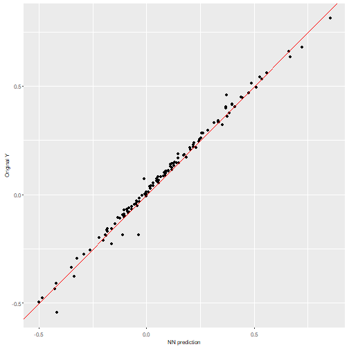
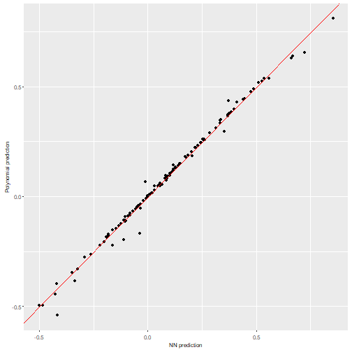
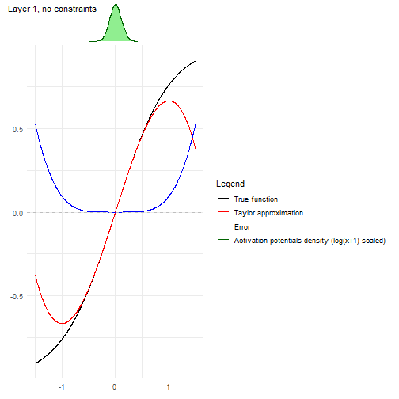
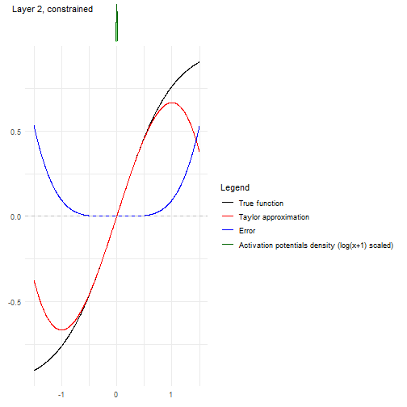
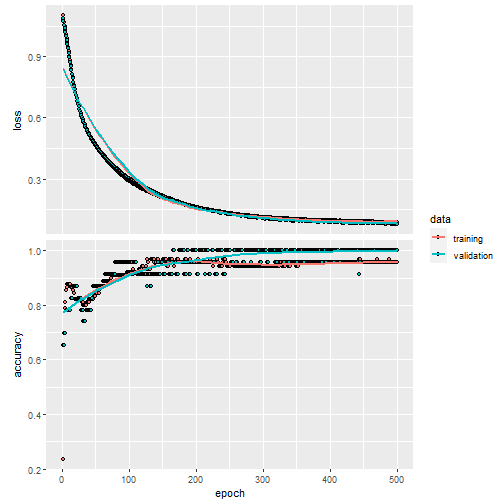
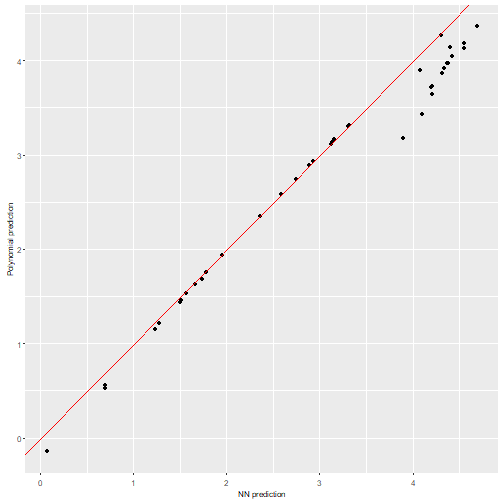
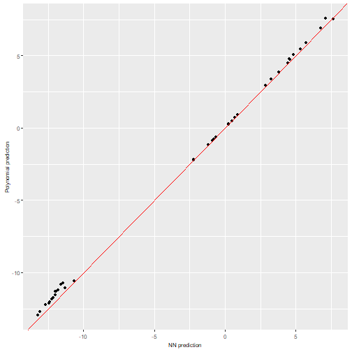
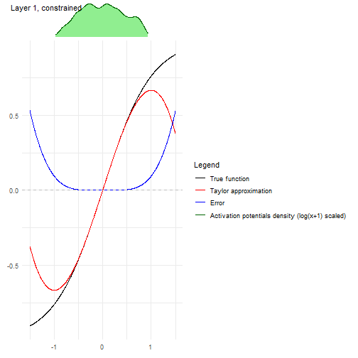
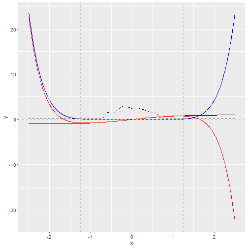

# This vignette's goal

The goal of this vignette is to present how to impose the needed constraints on the NN training so nn2poly can give accurate approximations of the NN. Therefore, this is a replication of `vignette("nn2poly-01-introduction")` steps, but imposing those constraints. Please refer to that introduction vignette to understand nn2poly basics and expand on the details that will be omitted here.

The initial setup will be the same, using `keras`and `tensorflow` to create and train the NN. Additionally, we will now use the auxiliary package `nn2poly.tools` that implements some helper functions to impose the desired constraints on the NN.


```r
library(nn2poly.tools)
library(nn2poly)
library(keras)
library(tensorflow)

# For reproducibility
set.seed(1)
tensorflow::tf$random$set_seed(1)
```


We will solve again two simple examples, regression and classification.

## Simple regression example

### Simulated data generation

We will simulate polynomial data from the following polynomial: $4x_1 - 3 x_2x_3$. Data will needs to be scaled to the $[-1,1]$ interval.


```r
# Define the desired polynomial for the simulated data
polynomial <- list()
polynomial$labels <- list(c(1), c(2,3))
polynomial$values <- c(4,-3)
```


```r
# Define number of variables p and sample n
p <- 3
n_sample <- 500

# Predictor variables
X <- matrix(0,n_sample,p)
for (i in 1:p){
  X[,i] <- rnorm(n = n_sample,0,1)
}

# Response variable + small error term
Y <- as.vector(eval_poly(X,polynomial)) + stats::rnorm(n_sample, 0, 0.1)

# Store all as a data frame
data <- as.data.frame(cbind(X, Y))
head(data)
#>           V1          V2          V3         Y
#> 1 -0.6264538  0.07730312  1.13496509 -2.684020
#> 2  0.1836433 -0.29686864  1.11193185  1.632335
#> 3 -0.8356286 -1.18324224 -0.87077763 -6.344179
#> 4  1.5952808  0.01129269  0.21073159  6.279883
#> 5  0.3295078  0.99160104  0.06939565  1.165488
#> 6 -0.8204684  1.59396745 -1.66264885  4.650553
```


```r
# Data scaling
maxs <- apply(data, 2, max)
mins <- apply(data, 2, min)
data <- as.data.frame(scale(data, center = mins + (maxs - mins) / 2, scale = (maxs - mins) / 2))

# Divide in train (0.75) and test (0.25)
index <- sample(1:nrow(data), round(0.75 * nrow(data)))
train <- data[index, ]
test <- data[-index, ]

train_x <- as.matrix(train[,-(p+1)])
train_y <- as.matrix(train[,(p+1)])

test_x <- as.matrix(test[,-(p+1)])
test_y <- as.matrix(test[,(p+1)])
```


## Original neural network (with constraints)

In this case, we need to use the custom layers from `nn2poly.tools` that include constraints. These constraints are different from the usual constraints in `keras` because in this case the restriction is applied to both the weight vector and the bias at each neuron at the same time, while usual `keras` constraints can only be employed on either the bias or the kernel weights.

Here we will use the L1 norm, checking that each vector of weights + bias arriving to a neuron satisfy that their L1 norm is equal or less than 1. This is created using the function `build_keras_model()` which requires:
- The input dimension `p`.
- A list with the activation functions at each layer `af_string_list`.
- A list with the number of neurons at each layer `h_neurons_vector`.
- A list `my_max_norm` consisting of two elements: the type of norm used (`l1_norm` in this case) and the maximum value (1 in this case).

We can define all these parameters as well as the ones used by `keras`:


```r
# keras hyperparameters
my_loss <- "mse"
my_metrics <- "mse"
my_optimizer <- optimizer_adam()
my_epochs <- 2000
my_validation_split <- 0.2
my_verbose <- 0

# Parameters:
af_string_list <- list("tanh", "tanh", "linear")
h_neurons_vector <- c(50, 50, 1) # If the output is linear, the last value should be 1
my_max_norm <- list("l1_norm",1)
```

Build the model with the custom constraints, then compile and fit the model:


```r
nn <- build_keras_model(p,
    af_string_list,
    h_neurons_vector,
    my_max_norm)

# Compile the model
compile(nn,
				loss = my_loss,
				optimizer = my_optimizer,
				metrics = my_metrics
)

# Fit the model
history <- fit(nn,
							 train_x,
							 train_y,
							 verbose = my_verbose,
							 epochs = my_epochs,
							 validation_split = my_validation_split,
							 batch_size = 50
)

nn
#> Model: "sequential_64"
#> __________________________________________________________________________________________________________________________
#>  Layer (type)                                         Output Shape                                     Param #            
#> ==========================================================================================================================
#>  layer__combined_l1_30 (Layer_Combined_L1)            (None, 50)                                       200                
#>  activation_30 (Activation)                           (None, 50)                                       0                  
#>  layer__combined_l1_31 (Layer_Combined_L1)            (None, 50)                                       2550               
#>  activation_31 (Activation)                           (None, 50)                                       0                  
#>  dense_69 (Dense)                                     (None, 1)                                        51                 
#> ==========================================================================================================================
#> Total params: 2,801
#> Trainable params: 2,801
#> Non-trainable params: 0
#> __________________________________________________________________________________________________________________________
```

We can visualize the training process:


```r
plot(history)
```


And we can also visualize the NN predictions vs the original Y values.


```r
# Obtain the predicted values with the NN to compare them
prediction_NN <- predict(nn, test_x)

# Diagonal plot implemented in the package to quickly visualize and compare predictions
plot_diagonal(x_axis =  prediction_NN, y_axis =  test_y, xlab = "NN prediction", ylab = "Original Y")
```



### Using nn2poly to obtain  the polynomial

After the NN has been trained (in this case with constraints) we extract and reshape the weights and NN parameters as explained in `vignette("nn2poly-01-introduction")`, with the only difference that the keras weights from the custom layers have a slightly different behavior as they already include the bias in the weights matrix:


```r

keras_weights <- keras::get_weights(nn)

n <- length(keras_weights)

nn_weights <- keras_weights[1:(n-2)]

# Add last layer as this one has the bias separated, it is not a custom layer
nn_weights[[n-1]] <- rbind(keras_weights[[n]], keras_weights[[n-1]])
```


The activation functions that we used can be stored as:


```r
af_string_list <- list("tanh","tanh", "linear")
```

And finally the order of the Taylor approximation that we are going to choose is 8 at each hidden layer. (The final polynomial order will be limited by `forced_max_Q=3`)


```r
q_taylor_vector <- c(8, 8,  1)
```

When the input is in the desired shape, the nn2poly method can be applied:


```r
final_poly <- nn2poly_algorithm(
  weights_list = nn_weights,
  af_string_list = af_string_list,
  q_taylor_vector = q_taylor_vector,
  store_coeffs = FALSE,
  forced_max_Q = 3
)
```


### Obtaining polynomial predictions


```r

# Obtain the predicted values for the test data with our polynomial
prediction_poly <- as.vector(eval_poly(x = test_x, poly = final_poly))
```


### Visualizing the results

- Diagonal plot. In this example, as we have imposed weight constraints the approximation is better.


```r
plot_diagonal(x_axis =  prediction_NN, y_axis =  prediction_poly, xlab = "NN prediction", ylab = "Polynomial prediction")
```



- Representing the activation potentials, it can be seen that now they are centered around zero, where nn2poly works best.


```r
plot_taylor_and_activation_potentials(data = train,
                                    weights_list = nn_weights,
                                    af_string_list = af_string_list,
                                    q_taylor_vector = q_taylor_vector)
#> [[1]]
```



```
#> 
#> [[2]]
```



## Simple classification example

In this example, instead of a regression problem we will show a classification example, where a NN will be trained to classify species with the `iris` dataset, and then nn2poly will be employed to obtain a polynomial for each species.


### Data preparation

We will load the `iris` and scale the data:


```r
# Load the data
data(iris)

# Change response to numeric. In this case, Species was already numeric,
# but this step is needed if it is a factor variable.
iris$Species <- as.numeric(iris$Species)

# Define dimension p (number of predictor variables)
p <- dim(iris)[2] - 1

# Define objective classes
n_class <- max(iris[,(p+1)])

# Move objective classes from (1:3) to (0:2), needed for tensorflow
iris[,(p+1)] <- iris[,(p+1)] - 1
```


```r
# Scale the data in the [-1,1] interval and separate train and test
# Only the predictor variables are scaled, not the response as those will be
# the different classes.
iris_x <- iris[,-(p+1)]
maxs <- apply(iris_x, 2, max)
mins <- apply(iris_x, 2, min)
data_x_scaled <- as.data.frame(scale(iris_x, center = mins + (maxs - mins) / 2, scale = (maxs - mins) / 2))
data <- cbind(data_x_scaled, iris[,(p+1)])

# Divide in train (0.75) and test (0.25)
index <- sample(1:nrow(data), round(0.75 * nrow(data)))
train <- data[index, ]
test <- data[-index, ]

train_x <- as.matrix(train[,-(p+1)])
train_y <- as.matrix(train[,(p+1)])

test_x <- as.matrix(test[,-(p+1)])
test_y <- as.matrix(test[,(p+1)])
```


### Original neural network

We can now train the NN, following the same procedure as in the regression problem and using the `build_keras_model` function which includes the layers with custom constrains.

First we define the parameters and keras hyperparameters:


```r
# keras hyperparameters
my_loss <- loss_sparse_categorical_crossentropy(from_logits = TRUE)
my_metrics <- "accuracy"
my_optimizer <- optimizer_adam()
my_epochs <- 500
my_validation_split <- 0.2
my_verbose <- 0

# Parameters:
af_string_list <- list("tanh", "tanh", "linear")
h_neurons_vector <- c(50, 50, n_class)
my_max_norm <- list("l1_norm",1)
```

Build the model with the custom constraints, then compile and fit the model:


```r
nn <- build_keras_model(p,
    af_string_list,
    h_neurons_vector,
    my_max_norm)

# Compile the model
compile(nn,
				loss = my_loss,
				optimizer = my_optimizer,
				metrics = my_metrics
)

# Fit the model
history <- fit(nn,
							 train_x,
							 train_y,
							 verbose = my_verbose,
							 epochs = my_epochs,
							 validation_split = my_validation_split,
							 batch_size = 50
)

nn
#> Model: "sequential_65"
#> __________________________________________________________________________________________________________________________
#>  Layer (type)                                         Output Shape                                     Param #            
#> ==========================================================================================================================
#>  layer__combined_l1_32 (Layer_Combined_L1)            (None, 50)                                       250                
#>  activation_32 (Activation)                           (None, 50)                                       0                  
#>  layer__combined_l1_33 (Layer_Combined_L1)            (None, 50)                                       2550               
#>  activation_33 (Activation)                           (None, 50)                                       0                  
#>  dense_70 (Dense)                                     (None, 3)                                        153                
#> ==========================================================================================================================
#> Total params: 2,953
#> Trainable params: 2,953
#> Non-trainable params: 0
#> __________________________________________________________________________________________________________________________
```

We can visualize the training process:


```r
plot(history)
```



In this case, to asses the NN accuracy we have to transform the nn output into a probability:


```r
probability_model <- keras_model_sequential() %>%
  nn() %>%
  layer_activation_softmax() %>%
  layer_lambda(k_argmax)
```

And predict the results for the test data:


```r
# Obtain the predicted classes with the NN to compare them
prediction_NN_class <- predict(probability_model, test_x)

# Also, the linear output can be predicted before the probability model
prediction_NN <- predict(nn, test_x)
```
We can use here a confusion matrix to visualize the results, where we can see that the NN correctly predicts the classes of each observation:


```r
# Create a confusion matrix
cm <- caret::confusionMatrix(as.factor(prediction_NN_class), as.factor(test_y))
cm
#> Confusion Matrix and Statistics
#> 
#>           Reference
#> Prediction  0  1  2
#>          0 15  0  0
#>          1  0 11  0
#>          2  0  0 12
#> 
#> Overall Statistics
#>                                      
#>                Accuracy : 1          
#>                  95% CI : (0.9075, 1)
#>     No Information Rate : 0.3947     
#>     P-Value [Acc > NIR] : 4.568e-16  
#>                                      
#>                   Kappa : 1          
#>                                      
#>  Mcnemar's Test P-Value : NA         
#> 
#> Statistics by Class:
#> 
#>                      Class: 0 Class: 1 Class: 2
#> Sensitivity            1.0000   1.0000   1.0000
#> Specificity            1.0000   1.0000   1.0000
#> Pos Pred Value         1.0000   1.0000   1.0000
#> Neg Pred Value         1.0000   1.0000   1.0000
#> Prevalence             0.3947   0.2895   0.3158
#> Detection Rate         0.3947   0.2895   0.3158
#> Detection Prevalence   0.3947   0.2895   0.3158
#> Balanced Accuracy      1.0000   1.0000   1.0000
```


### Using nn2poly to obtain  the polynomial

After the NN has been trained, we need to extract and reshape the parameters as explained in the regression case:


```r
keras_weights <- keras::get_weights(nn)

n <- length(keras_weights)

nn_weights <- keras_weights[1:(n-2)]

# Add last layer as this one has the bias separated, it is not a custom layer
nn_weights[[n-1]] <- rbind(keras_weights[[n]], keras_weights[[n-1]])
```


The activation functions that we used can be stored as:


```r
af_string_list <- list("tanh","tanh", "linear")
```


And finally the order of the Taylor approximation that we are going to choose is 8 at each hidden layer. (The final polynomial order will be limited by `forced_max_Q=3`)


```r
q_taylor_vector <- c(8, 8,  1)
```

When the input is in the desired shape, the nn2poly method can be applied:


```r
final_poly <- nn2poly_algorithm(
  weights_list = nn_weights,
  af_string_list = af_string_list,
  q_taylor_vector = q_taylor_vector,
  store_coeffs = FALSE,
  forced_max_Q = 3
)
```


### Obtaining polynomial predictions


```r

# Obtain the predicted values for the test data with our Polynomial Regression
prediction_poly_matrix <- eval_poly(x = test_x, poly = final_poly)

# Define probability model with keras fro the polynomial outputs
probability_poly <- keras_model_sequential() %>%
  layer_activation_softmax() %>%
  layer_lambda(k_argmax)

# Class prediction with the polynomial outputs (one row for each polynomial)
prediction_poly_class <- predict(probability_poly,t(prediction_poly_matrix))
```


### Visualising the results


```r

# Confussion matrix between NN class prediction and polynomial class prediction
cm <- caret::confusionMatrix(as.factor(prediction_NN_class), as.factor(prediction_poly_class))
cm
#> Confusion Matrix and Statistics
#> 
#>           Reference
#> Prediction  0  1  2
#>          0 15  0  0
#>          1  0 11  0
#>          2  0  0 12
#> 
#> Overall Statistics
#>                                      
#>                Accuracy : 1          
#>                  95% CI : (0.9075, 1)
#>     No Information Rate : 0.3947     
#>     P-Value [Acc > NIR] : 4.568e-16  
#>                                      
#>                   Kappa : 1          
#>                                      
#>  Mcnemar's Test P-Value : NA         
#> 
#> Statistics by Class:
#> 
#>                      Class: 0 Class: 1 Class: 2
#> Sensitivity            1.0000   1.0000   1.0000
#> Specificity            1.0000   1.0000   1.0000
#> Pos Pred Value         1.0000   1.0000   1.0000
#> Neg Pred Value         1.0000   1.0000   1.0000
#> Prevalence             0.3947   0.2895   0.3158
#> Detection Rate         0.3947   0.2895   0.3158
#> Detection Prevalence   0.3947   0.2895   0.3158
#> Balanced Accuracy      1.0000   1.0000   1.0000
```

We can compare, for each polynomial, its output with the the linear output of the NN. In this case, as constraints have been used in training, the results are much closer than what happened in `vignette("nn2poly-01-introduction")`


```r
for (i in 1:3){
  print(
    plot_diagonal(x_axis =  prediction_NN[,i],
                  y_axis =  prediction_poly_matrix[i,],
                  xlab = "NN prediction",
                  ylab = "Polynomial prediction")
        )
}
```



Finally, activation potentials can be visualized as follows, where it can be seen that the constraints have made the activations to be closer to zero than in the unrestricted case. However, there is still some dispersion in them that creates the slight deviations seen in the diagonal plots. However, the


```r
plot_taylor_and_activation_potentials(data = train,
                                    weights_list = nn_weights,
                                    af_string_list = af_string_list,
                                    q_taylor_vector = q_taylor_vector)
#> [[1]]
```



```
#> 
#> [[2]]
```




