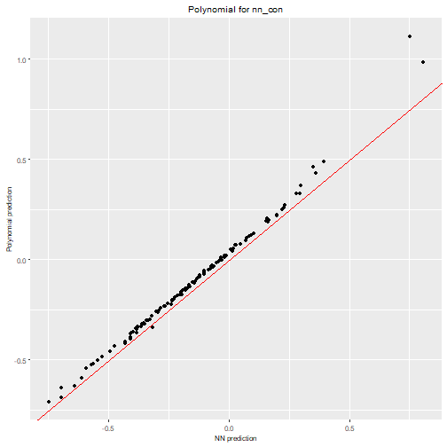

In this vignette we will explore the supported deep learning frameworks in `nn2poly` and how can they be used. Currently supported frameworks are `keras`/`tensorflow` and `luz`/`torch`. The benefit of using them is that we provide an easy to use implementation of the weight constraints needed during training to avoid problems in the Taylor expansion carried out by `nn2poly`. Furthermore, models created with these frameworks are directly supported by the `nn2poly()` function, allowing then to skip the need to manually create an object with weights and activation functions as explained in `vignette("nn2poly-01-introduction")`.

If you are interested in having support for another deep learning framework, please open an issue in our [GitHub repo](https://github.com/IBiDat/nn2poly)!

> *Note*: Using the provided constraints when training a model increases the number of needed epochs to converge, which is an expected trade off between learning speed and control over the weights for easier explainability.

# Data generation

As our goal here is to show how to impose the needed constraints for each framework, we will replicate the polynomial data generation from `vignette("nn2poly-01-introduction")` and solve later the same regression problem with the different deep learning frameworks. Refer to that vignette for more details.


```r
library(nn2poly)
set.seed(42)
```

Create the polynomial $4x_1 - 3 x_2x_3$:


```r

polynomial <- list()
polynomial$labels <- list(c(1), c(2,3))
polynomial$values <- c(4,-3)
```

Generate the data:


```r
# Define number of variables and sample size
p <- 3
n_sample <- 500

# Predictor variables
X <- matrix(0,n_sample,p)
for (i in 1:p){
  X[,i] <- rnorm(n = n_sample,0,1)
}

# Response variable + small error term
Y <- nn2poly:::eval_poly(poly = polynomial, newdata = X) +
  stats::rnorm(n_sample, 0, 0.1)

# Store all as a data frame
data <- as.data.frame(cbind(X, Y))
head(data)
#>           V1           V2         V3          Y
#> 1  1.3709584  1.029140719  2.3250585 -1.7547416
#> 2 -0.5646982  0.914774868  0.5241222 -3.7107357
#> 3  0.3631284 -0.002456267  0.9707334  1.3609395
#> 4  0.6328626  0.136009552  0.3769734  2.4608270
#> 5  0.4042683 -0.720153545 -0.9959334 -0.6141076
#> 6 -0.1061245 -0.198124330 -0.5974829 -0.7455793
```

Scale the data to have everything in the $[-1,1]$ interval and divide it in train and test.


```r
# Data scaling to [-1,1]
maxs <- apply(data, 2, max)
mins <- apply(data, 2, min)
data <- as.data.frame(scale(data, center = mins + (maxs - mins) / 2, scale = (maxs - mins) / 2))

# Divide in train (0.75) and test (0.25)
index <- sample(1:nrow(data), round(0.75 * nrow(data)))
train <- data[index, ]
test <- data[-index, ]

train_x <- as.matrix(train[,-(p+1)])
train_y <- as.matrix(train[,(p+1)])

test_x <- as.matrix(test[,-(p+1)])
test_y <- as.matrix(test[,(p+1)])
```


# Supported frameworks examples

With our common data generated, we are now ready to delve into the different deep learning frameworks. In each case we will solve the same regression problem with the previously generated polynomial data, with two neural networks for each framework. These neural networks will have the same structure but one will be constrained (`nn_con`) and the other one unconstrained (`nn_uncon`) to showcase their differences.


## `keras`/`tensorflow`

In this section we will show how to use `nn2poly` with a `keras` neural network and how to impose the needed weight constraints during training.


```r
library(nn2poly)
library(keras)

# This sets all needed seeds
tensorflow::set_random_seed(42)
```

### Model definition

First of all we will set the structure of our neural networks using a sequential model in `keras`. This following function will be used to create both the constrained and unconstrained neural networks in the `keras` example.


```r

keras_model <- function() {
  tensorflow::set_random_seed(42)

  nn <- keras::keras_model_sequential()
  nn <- keras::layer_dense(nn, units = 100, activation = "tanh", input_shape = p)
  nn <- keras::layer_dense(nn, units = 100, activation = "tanh")
  nn <- keras::layer_dense(nn, units = 100, activation = "tanh")
  nn <- keras::layer_dense(nn, units = 1, activation = "linear")

  nn
}
```

Now we define both NNs. The only needed step to impose our implemented weight constraints on a `keras` model is to use the function `add_constraints()` and then train it as usually. The constraints currently accept two possible types, `"l1_norm"` and `"l2_norm"`. In both cases, the norm for each weight vector (including the bias) incident on a neuron will be constrained to be less or equal than 1. Using data scaled to the $[-1,1]$ interval, the l1-norm is the one that guarantees best results.

Also, it is important to note that the weight constraints are imposed on all layers except for the last one, which is expected to be linear and not need a Taylor expansion.

> *Note*: Our implementation differs slightly from the constraints provided by `keras` because in our implementation we join the bias with the rest of the weights while `keras` default constraints allow only for bias or kernel constraints. Our implementation uses a custom callback that is applied at the end of each batch.


```r
nn_uncon <- keras_model()

nn_con <- keras_model()
nn_con <- add_constraints(nn_con, constraint_type = "l1_norm")
```

### Training

Now we can compile  and train both NNs using standard the `keras` approach. Note that we have to increase the number of needed epochs with the constrained NN to learn properly.


```r
compile(nn_uncon,
        loss = "mse",
        optimizer = optimizer_adam(),
        metrics = "mse")

history1 <- fit(nn_uncon,
               train_x,
               train_y,
               verbose = 0,
               epochs = 150,
               batch_size = 50,
               validation_split = 0.2
)

plot(history1)
```


```r
compile(nn_con,
        loss = "mse",
        optimizer = optimizer_adam(),
        metrics = "mse")

history2 <- fit(nn_con,
               train_x,
               train_y,
               verbose = 0,
               epochs = 700,
               batch_size = 50,
               validation_split = 0.2
)

plot(history2)
```


### NN predictions

We can visualize the NN predictions vs the original Y values for both neural networks and observe how both of them provide accurate predictions (the values fall near the "perfect" diagonal red line).


```r
# Obtain the predicted values with the NN to compare them
prediction_nn_uncon <- predict(nn_uncon, test_x)
#> 4/4 - 0s - 48ms/epoch - 12ms/step

# Diagonal plot implemented in the package to quickly visualize and compare predictions
nn2poly:::plot_diagonal(x_axis =  prediction_nn_uncon, y_axis =  test_y, xlab = "Unconstrained NN prediction", ylab = "Original Y")
```


```r
# Obtain the predicted values with the NN to compare them
prediction_nn_con <- predict(nn_con, test_x)
#> 4/4 - 0s - 91ms/epoch - 23ms/step

# Diagonal plot implemented in the package to quickly visualize and compare predictions
nn2poly:::plot_diagonal(x_axis =  prediction_nn_con, y_axis =  test_y, xlab = "Constrained NN prediction", ylab = "Original Y")
```


### Using nn2poly

After the NNs have been trained, we can directly call `nn2poly` on the `keras` model.


```r
# Polynomial for nn_uncon
final_poly_uncon <- nn2poly(object = nn_uncon,
                      max_order = 3)

# Polynomial for nn_con
final_poly_con <- nn2poly(object = nn_con,
                      max_order = 3)
```

We can visualize the polynomial predictions versus NN predictions


```r

# Obtain the predicted values for the test data with our two polynomials
prediction_poly_uncon <- predict(object = final_poly_uncon, newdata = test_x)
prediction_poly_con <- predict(object = final_poly_con, newdata = test_x)

nn2poly:::plot_diagonal(x_axis =  prediction_nn_uncon, y_axis =  prediction_poly_uncon, xlab = "NN prediction", ylab = "Polynomial prediction") + ggplot2::ggtitle("Polynomial for nn_uncon")
```


```r

nn2poly:::plot_diagonal(x_axis =  prediction_nn_con, y_axis =  prediction_poly_con, xlab = "NN prediction", ylab = "Polynomial prediction") + ggplot2::ggtitle("Polynomial for nn_con")
```


We can clearly see how the constrained NN allows to obtain a close approximation with `nn2poly` while the polynomial obtained for the unconstrained one is not a good representation.

We can also represent the obtained polynomial coefficients and observe how the constrained case clearly has terms `2,3` and `1` with the same sign as the original polynomial while the rest are close to 0.

> *Note*: The coefficients values are not in the same scale as the original polynomial due to the fact that we have scaled all the data before training, even the response variable Y. Furthermore, as data has been scaled to the $[-1,1]$ interval, interactions of order 2 or higher would usually need a higher absolute value than the lower order coefficients to be more relevant


```r
plot(final_poly_uncon, n = 8)
```


```r
plot(final_poly_con, n = 8)
```


## `luz`/`torch`

In this section we will show how to use `nn2poly` with a `torch` neural network, built with its higher level API `luz`, and how to impose the needed weight constraints during training. Furthermore, we will explain how to use `luz_model_sequential()`, a helper needed to create a `torch` model in an adequate manner so that it can be easily recognized by `nn2poly`.


```r
library(torch)
library(luz)

set.seed(42)
```

### Data loader for `torch`

In this framework, we need to manipulate a bit our data to use it as input for a `torch` model. This can be done dividing our `train_x` data intro only train and validation matrices and using `luz::as_dataloader()`


```r
# Divide in only train and validation
all_indices   <- 1:nrow(train_x)
only_train_indices <- sample(all_indices, size = round(nrow(train_x)) * 0.8)
val_indices   <- setdiff(all_indices, only_train_indices)

# Create lists with x and y values to feed luz::as_dataloader()
only_train_x <- as.matrix(train_x[only_train_indices,])
only_train_y <- as.matrix(train_y[only_train_indices,])
val_x <- as.matrix(train_x[val_indices,])
val_y <- as.matrix(train_y[val_indices,])

only_train_list <- list(x = only_train_x, y = only_train_y)
val_list <- list(x = val_x, y = val_y)

torch_data <- list(
  train = luz::as_dataloader(only_train_list, batch_size = 50, shuffle = TRUE),
  valid = luz::as_dataloader(val_list, batch_size = 50)
)
```


### Model definition

Now we will set the structure of our neural networks using a sequential model in `torch`. To do so we have implemented the helper `luz_model_sequential()`, which lets the user stack linear layers in a similar way as `keras` and allows `nn2poly()` to be directly used in the model without the need to extract weights and activation functions manually as in the default example of `vignette("nn2poly-01-introduction")`.

This following function will be used to create both the constrained and unconstrained neural networks in the `torch` example.


```r

luz_nn <- function() {
  torch::torch_manual_seed(42)

  luz_model_sequential(
    torch::nn_linear(p,100),
    torch::nn_tanh(),
    torch::nn_linear(100,100),
    torch::nn_tanh(),
    torch::nn_linear(100,100),
    torch::nn_tanh(),
    torch::nn_linear(100,1)
  )
}
```

Now we define both NNs. In this case, differing from the `keras` example, we will impose the constraints later to follow the same approach as in `luz` documentation. However, the use of `add_constraints()` is analogous.


```r
nn_uncon <- luz_nn()
nn_con <- luz_nn()
```

### Training

First we train the unconstrained NN using ans standard `luz` approach.


```r
fitted_uncon <- nn_uncon %>%
    luz::setup(
      loss = torch::nn_mse_loss(),
      optimizer = torch::optim_adam,
      metrics = list(
        luz::luz_metric_mse()
      )
    ) %>%
    luz::fit(torch_data$train, epochs = 50, valid_data = torch_data$valid)

fitted_uncon %>% plot()
```


Then, we train the  constrained NN by using the function function `add_constraints()` before calling `fit()`. The constraints currently accept two possible types, `"l1_norm"` and `"l2_norm"`. In both cases, the norm for each weight vector (including the bias) incident on a neuron will be constrained to be less or equal than 1. Using data scaled to the $[-1,1]$ interval, the l1-norm is the one that guarantees best results.

Also, it is important to note that the weight constraints are imposed on all layers except for the last one, which is expected to be linear and not need a Taylor expansion.

Note that we have to increase the number of needed epochs with the constrained NN to learn properly.


```r
fitted_con <- nn_con %>%
  luz::setup(
    loss = torch::nn_mse_loss(),
    optimizer = torch::optim_adam,
  ) %>%
  add_constraints("l1_norm") %>%
  fit(torch_data$train, epochs = 700, valid_data = torch_data$valid)

fitted_con %>% plot()
```


> *Note*: Our implementation uses a custom callback that is applied at the end of each batch.

### NN predictions

We can visualize the NN predictions vs the original Y values for both neural networks and observe how both of them provide accurate predictions (the values fall near the "perfect" diagonal red line).


```r
# Obtain the predicted values with the NN to compare them
prediction_NN_uncon <- as.array(predict(fitted_uncon, test_x))

# Diagonal plot implemented in the package to quickly visualize and compare predictions
nn2poly:::plot_diagonal(x_axis =  prediction_NN_uncon, y_axis =  test_y, xlab = "Unconstrained NN prediction", ylab = "Original Y")
```


```r
# Obtain the predicted values with the NN to compare them
prediction_NN_con <- as.array(predict(fitted_con, test_x))

# Diagonal plot implemented in the package to quickly visualize and compare predictions
nn2poly:::plot_diagonal(x_axis =  prediction_NN_con, y_axis =  test_y, xlab = "Constrained NN prediction", ylab = "Original Y")
```


### Using nn2poly

After the NNs have been trained, we can directly call `nn2poly` on the `luz` model.


```r
# Polynomial for nn_uncon
final_poly_uncon <- nn2poly(object = fitted_uncon,
                      max_order = 3)

# Polynomial for nn_con
final_poly_con <- nn2poly(object = fitted_con,
                      max_order = 3)
```

We can visualize the polynomial predictions versus NN predictions


```r

# Obtain the predicted values for the test data with our two polynomials
prediction_poly_uncon <- predict(object = final_poly_uncon, newdata = test_x)
prediction_poly_con <- predict(object = final_poly_con, newdata = test_x)

nn2poly:::plot_diagonal(x_axis =  prediction_nn_uncon, y_axis =  prediction_poly_uncon, xlab = "NN prediction", ylab = "Polynomial prediction") + ggplot2::ggtitle("Polynomial for nn_uncon")
```


```r

nn2poly:::plot_diagonal(x_axis =  prediction_nn_con, y_axis =  prediction_poly_con, xlab = "NN prediction", ylab = "Polynomial prediction") + ggplot2::ggtitle("Polynomial for nn_con")
```



We can clearly see how the constrained NN allows to obtain a close approximation with `nn2poly` while the polynomial obtained for the unconstrained one is not a good representation.

We can also represent the obtained polynomial coefficients and observe how the constrained case clearly has terms `2,3` and `1` with the same sign as the original polynomial while the rest are close to 0.

> *Note*: The coefficients values are not in the same scale as the original polynomial due to the fact that we have scaled all the data before training, even the response variable Y. Furthermore, as data has been scaled to the $[-1,1]$ interval, interactions of order 2 or higher would usually need a higher absolute value than the lower order coefficients to be more relevant


```r
plot(final_poly_uncon, n = 8)
```


```r
plot(final_poly_con, n = 8)
```


