# This vignette's goal

After showing how to use `nn2poly` in its default version in `vignette("nn2poly-01-introduction")`, here we will present how to use specific methods related to `keras` and `tensorflow` that allow for an easier and smoother use of `nn2poly` with that deep learning framework. Furthermore, we will sow how to impose the needed weight constraints in `tensorflow` during training to have accurate results and compare those results with an unconstrained neural network.

In this vignette we will focus on a simple regression example and a classification one is covered in `vignette("nn2poly-03-tensorflow-classification")`.


```r
library(nn2poly)
library(keras)

# This sets all needed seeds
tensorflow::set_random_seed(1)
```

# Simple regression example

## Simulated data generation

We will simulate polynomial data from the following polynomial: $4x_1 - 3 x_2x_3$. Data needs to be scaled to the $[-1,1]$ interval.


```r
# Define the desired polynomial for the simulated data
polynomial <- list()
polynomial$labels <- list(c(1), c(2,3))
polynomial$values <- c(4,-3)
```


```r
# Define number of variables p and sample n
p <- 3
n_sample <- 500

# Predictor variables
X <- matrix(0,n_sample,p)
for (i in 1:p){
  X[,i] <- rnorm(n = n_sample,0,1)
}

# Response variable + small error term
Y <- as.vector(eval_poly(X,polynomial)) + stats::rnorm(n_sample, 0, 0.1)

# Store all as a data frame
data <- as.data.frame(cbind(X, Y))
head(data)
#>           V1          V2          V3         Y
#> 1 -0.6264538  0.07730312  1.13496509 -2.684020
#> 2  0.1836433 -0.29686864  1.11193185  1.632335
#> 3 -0.8356286 -1.18324224 -0.87077763 -6.344179
#> 4  1.5952808  0.01129269  0.21073159  6.279883
#> 5  0.3295078  0.99160104  0.06939565  1.165488
#> 6 -0.8204684  1.59396745 -1.66264885  4.650553
```


```r
# Data scaling
maxs <- apply(data, 2, max)
mins <- apply(data, 2, min)
data <- as.data.frame(scale(data, center = mins + (maxs - mins) / 2, scale = (maxs - mins) / 2))

# Divide in train (0.75) and test (0.25)
index <- sample(1:nrow(data), round(0.75 * nrow(data)))
train <- data[index, ]
test <- data[-index, ]

train_x <- as.matrix(train[,-(p+1)])
train_y <- as.matrix(train[,(p+1)])

test_x <- as.matrix(test[,-(p+1)])
test_y <- as.matrix(test[,(p+1)])

plot(data)
```

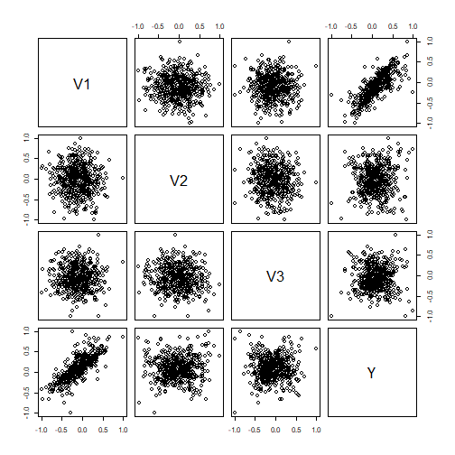


## Original neural networks

We will build and train two different neural networks (NNs), one with unconstrained weights (`nn1`) and another one imposing a constraint on the weights (`nn2`).

Different constraints can be tested, but the suggested constraint based on our theoretical and empirical evaluation is to use the L1 norm equal to 1, constraining each vector of weights + bias arriving to a neuron to satisfy that their L1 norm is equal or less than 1.

### Build NN 1, unconstrained

This NN will be built using standard tensorflow and keras practices, in this case with a sequential keras model without any constraint on the weights.


```r
nn1 <- keras_model_sequential()

nn1 %>% layer_dense(units = 100,
                  activation = "tanh",
                  input_shape = p)

nn1 %>% layer_dense(units = 100,
                  activation = "tanh")

nn1 %>% layer_dense(units = 100,
                  activation = "tanh")

nn1 %>% layer_dense(units = 1,
                  activation = "linear")

nn1
#> Model: "sequential_10"
#> ________________________________________________________________________________________________________________________
#>  Layer (type)                                         Output Shape                                    Param #           
#> ========================================================================================================================
#>  dense_15 (Dense)                                     (None, 100)                                     400               
#>  dense_16 (Dense)                                     (None, 100)                                     10100             
#>  dense_17 (Dense)                                     (None, 100)                                     10100             
#>  dense_18 (Dense)                                     (None, 1)                                       101               
#> ========================================================================================================================
#> Total params: 20,701
#> Trainable params: 20,701
#> Non-trainable params: 0
#> ________________________________________________________________________________________________________________________
```


### Build NN 2, constrained

In order to implement the desired constraints, we provide the `add_constraints()` function, that takes the structure of a given NN (has to be a feed forward dense NN) and modifies its layers to include the constraints. This is needed because default constraints implemented in `keras` do not support to impose a constraint at the same time on the weights and the bias and have to be combined with a custom layer.

Our implementation is such that the bias on each neuron is included in the weights vector incident on that neuron, meaning that if the previous layer had $h$ neurons, then the considered weight vector including the bias at a given neuron would have dimension $h+1$, having the bias as it first element. Currently, L1 norm and L2 norm equal to 1 are implemented as options.

Note that L1 norm equal to 1 when scaling the input data to the $[-1,1]$ interval is the recommended option.


```r
nn2 <- add_constraints(nn1, constraint_type = "l1_norm")
nn2
#> Model: "sequential_11"
#> ________________________________________________________________________________________________________________________
#>  Layer (type)                                         Output Shape                                    Param #           
#> ========================================================================================================================
#>  layer__combined_l1_5 (Layer_Combined_L1)             (None, 100)                                     400               
#>  layer__combined_l1_6 (Layer_Combined_L1)             (None, 100)                                     10100             
#>  layer__combined_l1_7 (Layer_Combined_L1)             (None, 100)                                     10100             
#>  dense_19 (Dense)                                     (None, 1)                                       101               
#> ========================================================================================================================
#> Total params: 20,701
#> Trainable params: 20,701
#> Non-trainable params: 0
#> ________________________________________________________________________________________________________________________
```
Note how the parameters and structure are the same, but the layer type has been modified.


### Compile and train both NNs

After building both NNs, we compile and train both of them. Note that, as constraining the weights has trade-off in the learning speed of the NN, the `nn2` needs a higher number of epochs to properly learn from the data.


Compile and train `nn1` the model, and visualize its training history:


```r
compile(nn1,
        loss = "mse",
        optimizer = optimizer_adam(),
        metrics = "mse")

history1 <- fit(nn1,
               train_x,
               train_y,
               verbose = 0,
               epochs = 300,
               batch_size = 50,
               validation_split = 0.2
)

plot(history1)
```

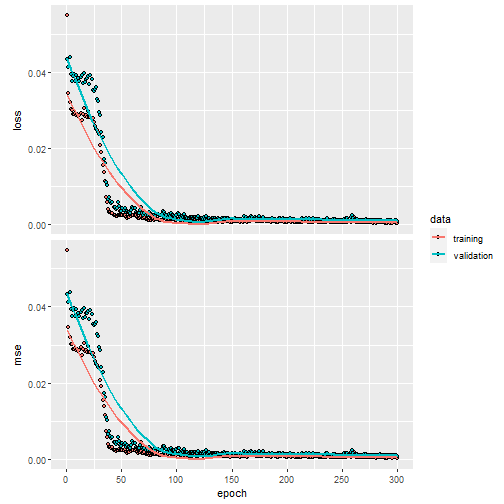


Compile and train `nn2` the model, and visualize its training history:


```r
compile(nn2,
        loss = "mse",
        optimizer = optimizer_adam(),
        metrics = "mse")

history2 <- fit(nn2,
               train_x,
               train_y,
               verbose = 0,
               epochs = 2000,
               batch_size = 50,
               validation_split = 0.2
)

plot(history2)
```

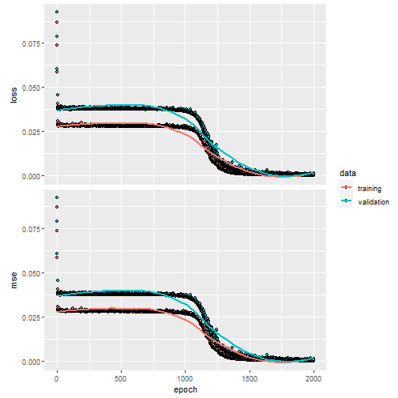


### Visualize both NN predictions

We can visualize the NN predictions vs the original Y values for both neural networks and observe how both of them provide accurate predictions (the values fall near the "perfect" diagonal red line).


```r
# Obtain the predicted values with the NN to compare them
prediction_NN1 <- predict(nn1, test_x)

# Diagonal plot implemented in the package to quickly visualize and compare predictions
plot_diagonal(x_axis =  prediction_NN1, y_axis =  test_y, xlab = "NN 1 prediction", ylab = "Original Y")
```

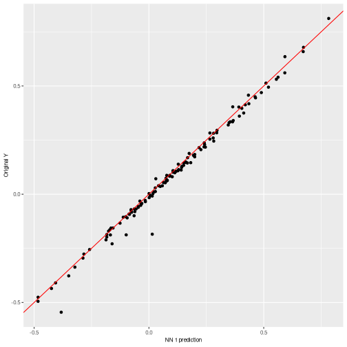


```r
# Obtain the predicted values with the NN to compare them
prediction_NN2 <- predict(nn2, test_x)

# Diagonal plot implemented in the package to quickly visualize and compare predictions
plot_diagonal(x_axis =  prediction_NN2, y_axis =  test_y, xlab = "NN 2 prediction", ylab = "Original Y")
```

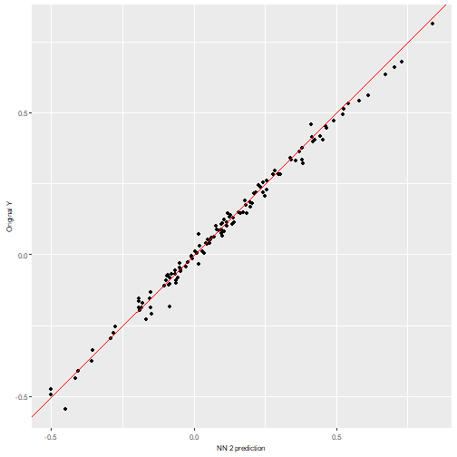

## Using nn2poly to obtain  the polynomial

After the NNs have been trained, we can directly call `nn2poly` on the `keras` model. Therefore, we do not need to build an object with weights and activation functions as in the default case covered in `vignette("nn2poly-01-introduction")`, and can benefit from the generic methods implemented for `keras` models.

The only parameters that have to be added for nn2poly to work is the Taylor order expansion at each layer (`taylor_orders`), where we will choose 8 by default on non linear layers and 1 in the last linear layer as Taylor is not used there. (The final polynomial order will be limited by `max_order=3`)

We will do this for both neural networks and compare the results:


```r
taylor_orders <- c(8, 8, 8, 1)

# Polynomial for nn1
final_poly1 <- nn2poly(object = nn1,
                      taylor_orders = taylor_orders,
                      max_order = 3)

# Polynomial for nn2
final_poly2 <- nn2poly(object = nn2,
                      taylor_orders = taylor_orders,
                      max_order = 3)
```


## Obtaining polynomial predictions


```r

# Obtain the predicted values for the test data with our two polynomials

prediction_poly1 <- eval_poly(x = test_x, poly = final_poly1)

prediction_poly2 <- eval_poly(x = test_x, poly = final_poly2)
```


## Visualizing the results

With the polynomial predictions, we can plot them using our diagonal plot to compare them with their respective NN predictions. Please note here that we compare the predictions of the polynomial with the NN predictions and not the original data, as `nn2poly`'s goal is to faithfully represent the NN behavior independently of how well the NN predicts.

We can observe clearly how the polynomial obtained for the constrained network (`nn2`) is predicting almost the same, while the unconstrained network has significant errors.


```r
plot_diagonal(x_axis =  prediction_NN1, y_axis =  prediction_poly1, xlab = "NN prediction", ylab = "Polynomial prediction") + ggplot2::ggtitle("Polynomial for NN1")
```


```r

plot_diagonal(x_axis =  prediction_NN2, y_axis =  prediction_poly2, xlab = "NN prediction", ylab = "Polynomial prediction") + ggplot2::ggtitle("Polynomial for NN2")
```

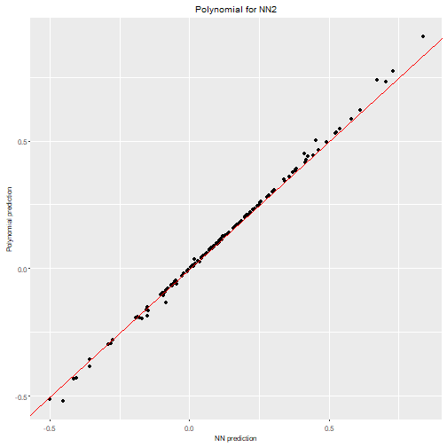

We can also plot the $n$ most important coefficients in absolute value to compare which variables or interactions are more relevant in the polynomial. Note that, as data should be scaled to the $[-1,1]$ interval, interactions of order 2 or higher would usually need a higher absolute value than the lower order coefficients to be more relevant.

Recall that the original polynomial was $4x_1 - 3x_2x_3$. If we observe the polynomial from `nn2`, precisely interaction `2,3` has a high negative coefficient while variable `1` has a positive one and the rest of variables and the intercept (`0`) are quite close to zero. However, in the polynomial from `nn1`, the obtained coefficients are not correct as Taylor expansion is failing because of the high weights.


```r
plot_n_important_coeffs(final_poly1, n_important_coeffs = 8)
```

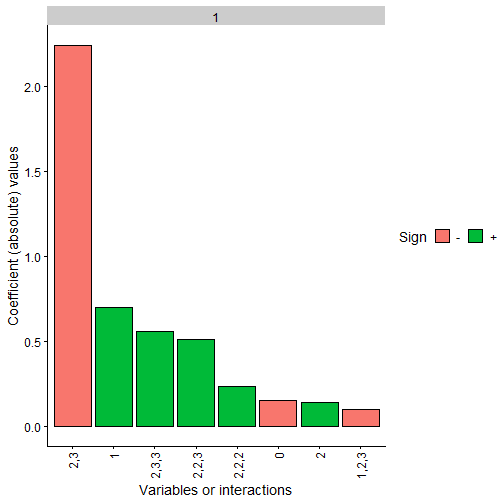

```r
plot_n_important_coeffs(final_poly2, n_important_coeffs = 8)
```

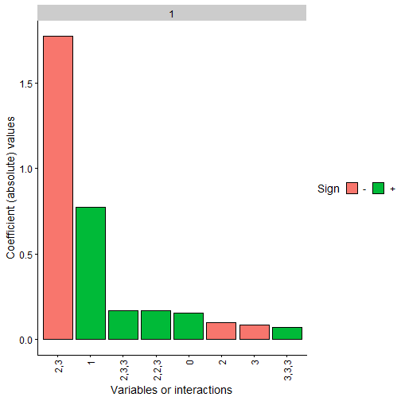

Finally, the problem with Taylor expansion can be checked with the following plot, where each layer is represented with their activation function, its Taylor expansion, the error and also the density of the activation potentials that the activation functions receives at that layer.

It can be clearly seen with the activation potentials density, in green, that it expands over a wide range in the unconstrained NN while the it is kept closer to zero in the constrained one, thus having a more accurate Taylor expansion  around zero.


```r
plot_taylor_and_activation_potentials(object = nn1,
                                      data = train,
                                      taylor_orders = taylor_orders,
                                      max_order = 3,
                                      constraints = FALSE)
#> [[1]]
```


```
#> 
#> [[2]]
```


```
#> 
#> [[3]]
```

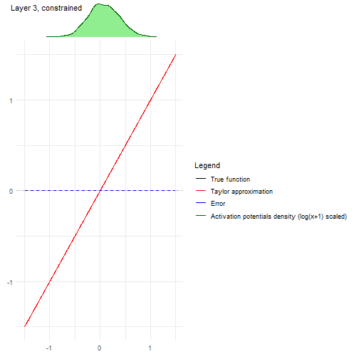

```
#> 
#> [[4]]
```


```r

plot_taylor_and_activation_potentials(object = nn2,
                                      data = train,
                                      taylor_orders = taylor_orders,
                                      max_order = 3,
                                      constraints = TRUE)
#> [[1]]
```

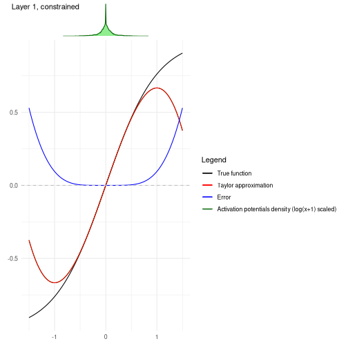

```
#> 
#> [[2]]
```


```
#> 
#> [[3]]
```

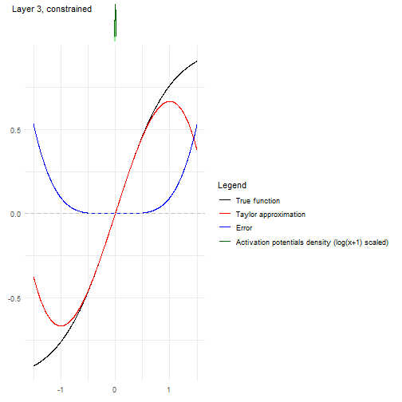

```
#> 
#> [[4]]
```


