# This vignette's goal

After showing how to use `nn2poly` in its default version in `vignette("nn2poly-01-introduction")`, here we will present how to use specific methods related to `keras` and `tensorflow` that allow for an easier and smoother use of `nn2poly` with that deep learning framework. Furthermore, we will sow how to impose the needed weight constraints in `tensorflow` during training to have accurate results and compare those results with an unconstrained neural network.

In this vignette we will focus on a simple classification example using the `iris` dataset. A regression one is covered in `vignette("nn2poly-02-tensorflow-regression")`.


```r
library(nn2poly)
library(keras)

# This sets all needed seeds
tensorflow::set_random_seed(1)
```


# Simple classification example

## Data preparation

First we load the `iris` dataset and scale the data to the $[-1,1]$ interval:


```r
# Load the data
data(iris)

# Change response to numeric. In this case, Species was already numeric,
# but this step is needed if it is a factor variable.
iris$Species <- as.numeric(iris$Species)

# Define dimension p (number of predictor variables)
p <- dim(iris)[2] - 1

# Define objective classes
n_class <- max(iris[,(p+1)])

# Move objective classes from (1:3) to (0:2), needed for tensorflow
iris[,(p+1)] <- iris[,(p+1)] - 1
```


```r
# Scale the data in the [-1,1] interval and separate train and test
# Only the predictor variables are scaled, not the response as those will be
# the different classes.
iris_x <- iris[,-(p+1)]
maxs <- apply(iris_x, 2, max)
mins <- apply(iris_x, 2, min)
data_x_scaled <- as.data.frame(scale(iris_x, center = mins + (maxs - mins) / 2, scale = (maxs - mins) / 2))
data <- cbind(data_x_scaled, iris[,(p+1)])

# Divide in train (0.75) and test (0.25)
index <- sample(1:nrow(data), round(0.75 * nrow(data)))
train <- data[index, ]
test <- data[-index, ]

train_x <- as.matrix(train[,-(p+1)])
train_y <- as.matrix(train[,(p+1)])

test_x <- as.matrix(test[,-(p+1)])
test_y <- as.matrix(test[,(p+1)])
```


## Original neural networks

We will build and train two different neural networks (NNs), one with unconstrained weights (`nn1`) and another one imposing a constraint on the weights (`nn2`).

Different constraints can be tested, but the suggested constraint based on our theoretical and empirical evaluation is to use the L1 norm equal to 1, constraining each vector of weights + bias arriving to a neuron to satisfy that their L1 norm is equal or less than 1.


### Build NN 1, unconstrained

First, we build the model. Note that in this case the NN has a linear output with the same number of neurons as the number of classes to predict (3 species, `n_class`). Then, the linear output will be transformed in a probability to find the most probable class but this step is done after training. Therefore, nn2poly will be used to obtain a polynomial that approximates this nn with linear outputs and then its results will also be transformed in probabilities to  predict the highest probability class.

This NN will be built using standard tensorflow and keras practices, in this case with a sequential keras model without any constraint on the weights.

We will define a function that creates the desired model and then use it to define two different networks, unconstrained/constrained.


```r

keras_model <- function() {
  tensorflow::set_random_seed(42)

  nn <- keras::keras_model_sequential()
  nn <- keras::layer_dense(nn, units = 100, activation = "tanh", input_shape = p)
  nn <- keras::layer_dense(nn, units = 100, activation = "tanh")
  nn <- keras::layer_dense(nn, units = n_class, activation = "linear")

  nn
}
```

Then we define `nn1`, which will be the unconstrained NN.


```r
nn1 <- keras_model()

nn1
#> Model: "sequential_12"
#> _________________________________________________________________________________________________________________
#>  Layer (type)                                     Output Shape                                  Param #          
#> =================================================================================================================
#>  dense_28 (Dense)                                 (None, 100)                                   500              
#>  dense_29 (Dense)                                 (None, 100)                                   10100            
#>  dense_30 (Dense)                                 (None, 3)                                     303              
#> =================================================================================================================
#> Total params: 10,903
#> Trainable params: 10,903
#> Non-trainable params: 0
#> _________________________________________________________________________________________________________________
```


### Build NN 2, constrained

In order to implement the desired constraints, we provide the `add_constraints()` function, that takes the structure of a given NN (has to be a feed forward dense NN) and modifies its layers to include the constraints. This is needed because default constraints implemented in `keras` do not support to impose a constraint at the same time on the weights and the bias and have to be combined with a custom layer.

Our implementation is such that the bias on each neuron is included in the weights vector incident on that neuron, meaning that if the previous layer had $h$ neurons, then the considered weight vector including the bias at a given neuron would have dimension $h+1$, having the bias as it first element. Currently, L1 norm and L2 norm equal to 1 are implemented as options.

Note that L1 norm equal to 1 when scaling the input data to the $[-1,1]$ interval is the recommended option.


```r
nn2 <- keras_model()
nn2 <- add_constraints(nn2, constraint_type = "l1_norm")
nn2
#> Model: "sequential_13"
#> _________________________________________________________________________________________________________________
#>  Layer (type)                                     Output Shape                                  Param #          
#> =================================================================================================================
#>  dense_31 (Dense)                                 (None, 100)                                   500              
#>  dense_32 (Dense)                                 (None, 100)                                   10100            
#>  dense_33 (Dense)                                 (None, 3)                                     303              
#> =================================================================================================================
#> Total params: 10,903
#> Trainable params: 10,903
#> Non-trainable params: 0
#> _________________________________________________________________________________________________________________
```

Note how the parameters and structure are the same, but the layer type has been modified.

### Compile and train both NNs

After building both NNs, we compile and train both of them. Note that, as constraining the weights has trade-off in the learning speed of the NN, the `nn2` needs a higher number of epochs to properly learn from the data.

In this case, we need to define a categorical crossentropy loss and use the accuracy as the chosen metric.

Compile and train `nn1` the model, and visualize it:


```r
compile(nn1,
        loss = loss_sparse_categorical_crossentropy(from_logits = TRUE),
        optimizer = optimizer_adam(),
        metrics = "accuracy")

history1 <- fit(nn1,
               train_x,
               train_y,
               verbose = 0,
               epochs = 200,
               validation_split = 0.3
)

plot(history1)
```

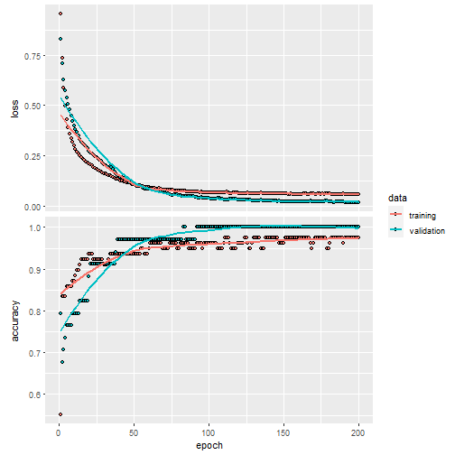

Compile and train `nn2` the model, and visualize it:


```r
compile(nn2,
        loss = loss_sparse_categorical_crossentropy(from_logits = TRUE),
        optimizer = optimizer_adam(),
        metrics = "accuracy")

history2 <- fit(nn2,
               train_x,
               train_y,
               verbose = 0,
               epochs = 300,
               validation_split = 0.3
)

plot(history2)
```

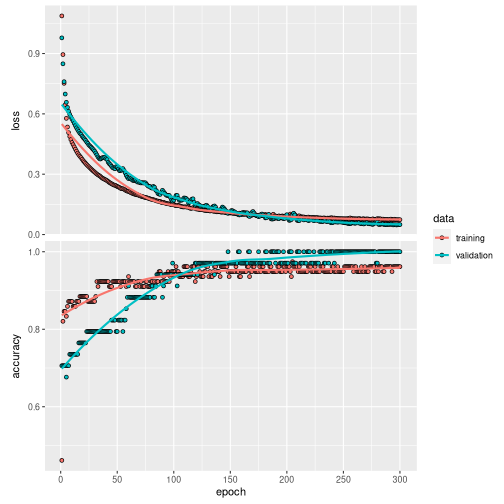

### Obtain the predicionts

In this case, to asses the NNs accuracy we have to transform their output into a probability:


```r
probability_model1 <- keras_model_sequential() %>%
  nn1() %>%
  layer_activation_softmax() %>%
  layer_lambda(k_argmax)
```


```r
probability_model2 <- keras_model_sequential() %>%
  nn2() %>%
  layer_activation_softmax() %>%
  layer_lambda(k_argmax)
```

And predict the results with the test data for each neural network. (We also predict and store the linear response of the NNs to be compared later with the polynomial output)


```r
# Obtain the predicted classes with the NN to compare them
prediction_NN_class1 <- predict(probability_model1, test_x)

# Also, the linear output can be predicted before the probability model
prediction_NN1 <- predict(nn1, test_x)
```


```r
# Obtain the predicted classes with the NN to compare them
prediction_NN_class2 <- predict(probability_model2, test_x)

# Also, the linear output can be predicted before the probability model
prediction_NN2 <- predict(nn2, test_x)
```
### Visualize the NNs results:

We can use here a confusion matrix to visualize the results, where we can see that both NNs correctly predicts almost all of the classes in the test data:


```r
# Create a confusion matrix
cm1 <- caret::confusionMatrix(as.factor(prediction_NN_class1), as.factor(test_y))
cm1
#> Confusion Matrix and Statistics
#> 
#>           Reference
#> Prediction  0  1  2
#>          0 13  0  0
#>          1  0 14  0
#>          2  0  0 11
#> 
#> Overall Statistics
#>                                      
#>                Accuracy : 1          
#>                  95% CI : (0.9075, 1)
#>     No Information Rate : 0.3684     
#>     P-Value [Acc > NIR] : < 2.2e-16  
#>                                      
#>                   Kappa : 1          
#>                                      
#>  Mcnemar's Test P-Value : NA         
#> 
#> Statistics by Class:
#> 
#>                      Class: 0 Class: 1 Class: 2
#> Sensitivity            1.0000   1.0000   1.0000
#> Specificity            1.0000   1.0000   1.0000
#> Pos Pred Value         1.0000   1.0000   1.0000
#> Neg Pred Value         1.0000   1.0000   1.0000
#> Prevalence             0.3421   0.3684   0.2895
#> Detection Rate         0.3421   0.3684   0.2895
#> Detection Prevalence   0.3421   0.3684   0.2895
#> Balanced Accuracy      1.0000   1.0000   1.0000
```


```r
# Create a confusion matrix
cm2 <- caret::confusionMatrix(as.factor(prediction_NN_class2), as.factor(test_y))
cm2
#> Confusion Matrix and Statistics
#> 
#>           Reference
#> Prediction  0  1  2
#>          0 13  0  0
#>          1  0 14  1
#>          2  0  0 10
#> 
#> Overall Statistics
#>                                           
#>                Accuracy : 0.9737          
#>                  95% CI : (0.8619, 0.9993)
#>     No Information Rate : 0.3684          
#>     P-Value [Acc > NIR] : 2.196e-15       
#>                                           
#>                   Kappa : 0.9602          
#>                                           
#>  Mcnemar's Test P-Value : NA              
#> 
#> Statistics by Class:
#> 
#>                      Class: 0 Class: 1 Class: 2
#> Sensitivity            1.0000   1.0000   0.9091
#> Specificity            1.0000   0.9583   1.0000
#> Pos Pred Value         1.0000   0.9333   1.0000
#> Neg Pred Value         1.0000   1.0000   0.9643
#> Prevalence             0.3421   0.3684   0.2895
#> Detection Rate         0.3421   0.3684   0.2632
#> Detection Prevalence   0.3421   0.3947   0.2632
#> Balanced Accuracy      1.0000   0.9792   0.9545
```

## Using nn2poly to obtain  the polynomial

After the NNs have been trained, we can directly call `nn2poly` on the `keras` model. Therefore, we do not need to build an object with weights and activation functions as in the default case covered in `vignette("nn2poly-01-introduction")`, and can benefit from the generic methods implemented for `keras` models.

The only parameter that has to be added for nn2poly to work is the final polynomial order that we want, limited by `max_order=3`.

Note that in this case, as we have 3 output neurons, there will be 3 output polynomials. The polynomials will be stored in the same way as in the regression case, in a list with labels and values, but in this case the values will be a matrix instead of a vector, where each row will be the polynomial obtained for each output neuron.

We will do this for both neural networks and compare the results:


```r

# Polynomial for nn1
final_poly1 <- nn2poly(object = nn1,
                      max_order = 3)

# Polynomial for nn2
final_poly2 <- nn2poly(object = nn2,
                      max_order = 3)
```


## Obtaining polynomial predictions

As said before, the obtained polynomial represents the neural network before including the softmax function and computing the class assigned to each observation. Then, we need to define again a keras sequential model that includes the class computation from the polynomial output. This polynomial output is obtained with `eval_poly()`, in this case in matrix form, as the 3 polynomials are evaluated at the same time:


```r

# Obtain the predicted values for the test data with our Polynomial Regression
prediction_poly_matrix1 <- eval_poly(x = test_x, poly = final_poly1)

# Define probability model with keras fro the polynomial outputs
probability_poly1 <- keras_model_sequential() %>%
  layer_activation_softmax() %>%
  layer_lambda(k_argmax)

# Class prediction with the polynomial outputs
prediction_poly_class1 <- predict(probability_poly1,t(prediction_poly_matrix1))
```


```r

# Obtain the predicted values for the test data with our Polynomial Regression
prediction_poly_matrix2 <- eval_poly(x = test_x, poly = final_poly2)

# Define probability model with keras fro the polynomial outputs
probability_poly2 <- keras_model_sequential() %>%
  layer_activation_softmax() %>%
  layer_lambda(k_argmax)

# Class prediction with the polynomial outputs
prediction_poly_class2 <- predict(probability_poly2,t(prediction_poly_matrix2))
```

## Visualizing the results

With the polynomial predictions, there are two options. We can represent in a diagonal line the linear outputs obtained directly from the polynomial and NN predictions, or compare the assigned classes after employing the probability models. Please note here that we compare the predictions (linear and classes) of the polynomials with the NN predictions and not the original data, as `nn2poly`'s goal is to faithfully represent the NN behavior independently of how well the NN predicts.

First, let's observe the confusion matrix for both NNs:


```r

# Confussion matrix between NN class prediction and polynomial class prediction
cm_poly1 <- caret::confusionMatrix(as.factor(prediction_NN_class1), as.factor(prediction_poly_class1))
cm_poly1
#> Confusion Matrix and Statistics
#> 
#>           Reference
#> Prediction  0  1  2
#>          0 13  0  0
#>          1  0 14  0
#>          2  0  0 11
#> 
#> Overall Statistics
#>                                      
#>                Accuracy : 1          
#>                  95% CI : (0.9075, 1)
#>     No Information Rate : 0.3684     
#>     P-Value [Acc > NIR] : < 2.2e-16  
#>                                      
#>                   Kappa : 1          
#>                                      
#>  Mcnemar's Test P-Value : NA         
#> 
#> Statistics by Class:
#> 
#>                      Class: 0 Class: 1 Class: 2
#> Sensitivity            1.0000   1.0000   1.0000
#> Specificity            1.0000   1.0000   1.0000
#> Pos Pred Value         1.0000   1.0000   1.0000
#> Neg Pred Value         1.0000   1.0000   1.0000
#> Prevalence             0.3421   0.3684   0.2895
#> Detection Rate         0.3421   0.3684   0.2895
#> Detection Prevalence   0.3421   0.3684   0.2895
#> Balanced Accuracy      1.0000   1.0000   1.0000
```


```r

# Confussion matrix between NN class prediction and polynomial class prediction
cm_poly2 <- caret::confusionMatrix(as.factor(prediction_NN_class2), as.factor(prediction_poly_class2))
cm_poly2
#> Confusion Matrix and Statistics
#> 
#>           Reference
#> Prediction  0  1  2
#>          0 13  0  0
#>          1  0 15  0
#>          2  0  0 10
#> 
#> Overall Statistics
#>                                      
#>                Accuracy : 1          
#>                  95% CI : (0.9075, 1)
#>     No Information Rate : 0.3947     
#>     P-Value [Acc > NIR] : 4.568e-16  
#>                                      
#>                   Kappa : 1          
#>                                      
#>  Mcnemar's Test P-Value : NA         
#> 
#> Statistics by Class:
#> 
#>                      Class: 0 Class: 1 Class: 2
#> Sensitivity            1.0000   1.0000   1.0000
#> Specificity            1.0000   1.0000   1.0000
#> Pos Pred Value         1.0000   1.0000   1.0000
#> Neg Pred Value         1.0000   1.0000   1.0000
#> Prevalence             0.3421   0.3947   0.2632
#> Detection Rate         0.3421   0.3947   0.2632
#> Detection Prevalence   0.3421   0.3947   0.2632
#> Balanced Accuracy      1.0000   1.0000   1.0000
```


Then, we can extract a diagonal plot for each of the polynomials obtained for each NN, in total $3\times 2=6$ diagonal plots.


```r
for (i in 1:3){
  print(
    plot_diagonal(x_axis =  prediction_NN1[,i],
                  y_axis =  prediction_poly_matrix1[i,],
                  xlab = "NN prediction",
                  ylab = "Polynomial prediction")
        )
}
```

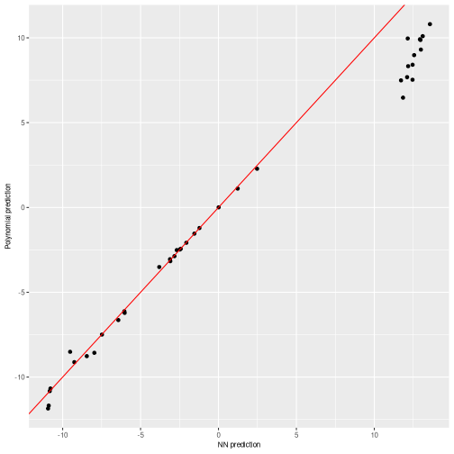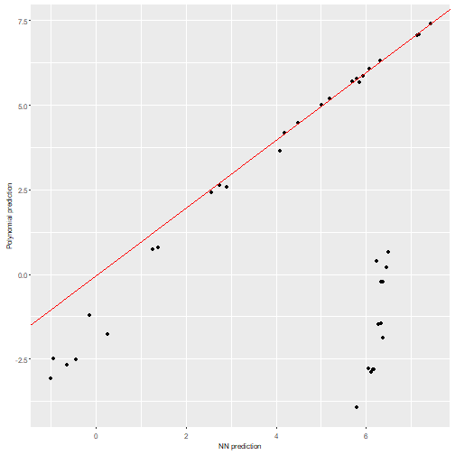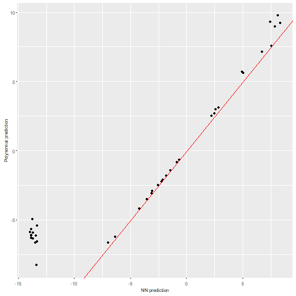


```r
for (i in 1:3){
  print(
    plot_diagonal(x_axis =  prediction_NN2[,i],
                  y_axis =  prediction_poly_matrix2[i,],
                  xlab = "NN prediction",
                  ylab = "Polynomial prediction")
        )
}
```

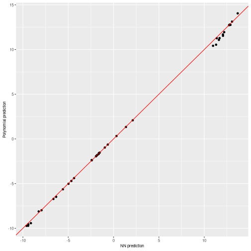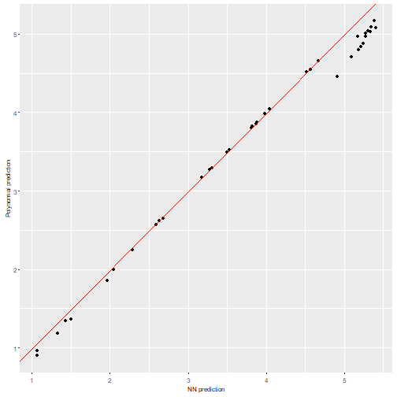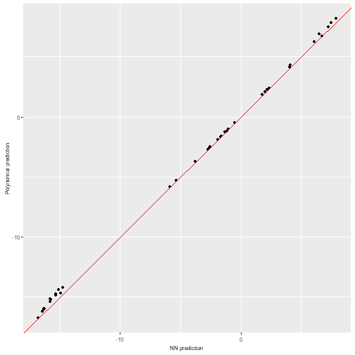

We can observe how both polynomials obtain quite similar predictions to their equivalent NN predictions, specially the second polynomial has a 100% accuracy. However, when comparing the linear outputs, the unconstrained NN presents some problems while the constrained one is quite accurate.

We can also plot the $n$ most important coefficients in absolute value to compare which variables or interactions are more relevant in the polynomial. Note that, as data should be scaled to the $[-1,1]$ interval, interactions of order 2 or higher would usually need a higher absolute value than the lower order coefficients to be more relevant.

In this case, we will have 3 plots for each NN again, one per polynomial at each output neuron. In this case, the obtained coefficients will represent the most important variables when assigning the probability to be in each class.

We can see that the coefficients share some characteristics like being positive or negative between the `nn1`and `nn2` interpretations, as expected by how their predictions did not differ too much.


```r
plot_n_important_coeffs(final_poly1, n_important_coeffs = 8)
```


```r
plot_n_important_coeffs(final_poly2, n_important_coeffs = 8)
```

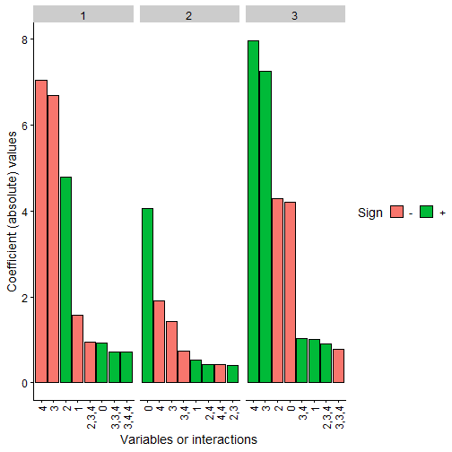

Finally, the problem with Taylor expansion can be checked with the following plot, where each layer is represented with their activation function, its Taylor expansion, the error and also the density of the activation potentials that the activation functions receives at that layer.

It can be clearly seen with the activation potentials density, in green, that it expands over a wide range in the unconstrained NN while the it is kept closer to zero in the constrained one, thus having a more accurate Taylor expansion  around zero.


```r
plot_taylor_and_activation_potentials(object = nn1,
                                      data = train,
                                      max_order = 3,
                                      constraints = FALSE)
#> [[1]]
```


```
#> 
#> [[2]]
```


```
#> 
#> [[3]]
```


```r

plot_taylor_and_activation_potentials(object = nn2,
                                      data = train,
                                      max_order = 3,
                                      constraints = TRUE)
#> [[1]]
```

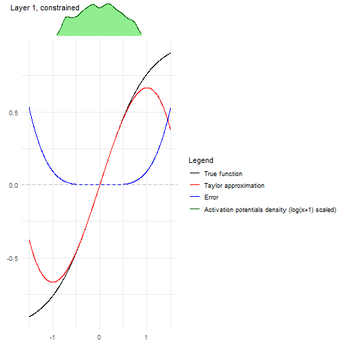

```
#> 
#> [[2]]
```

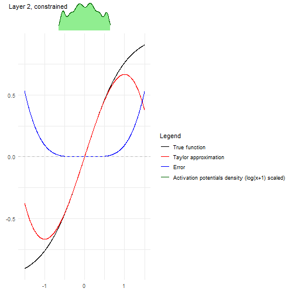

```
#> 
#> [[3]]
```

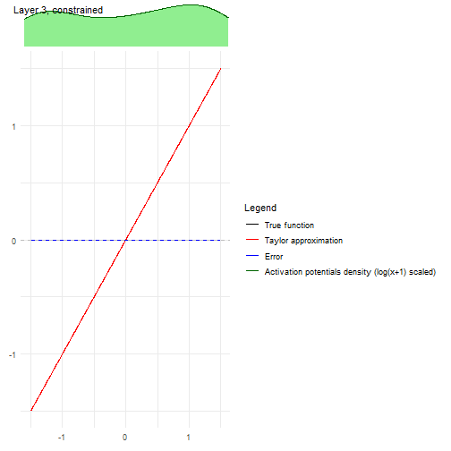
